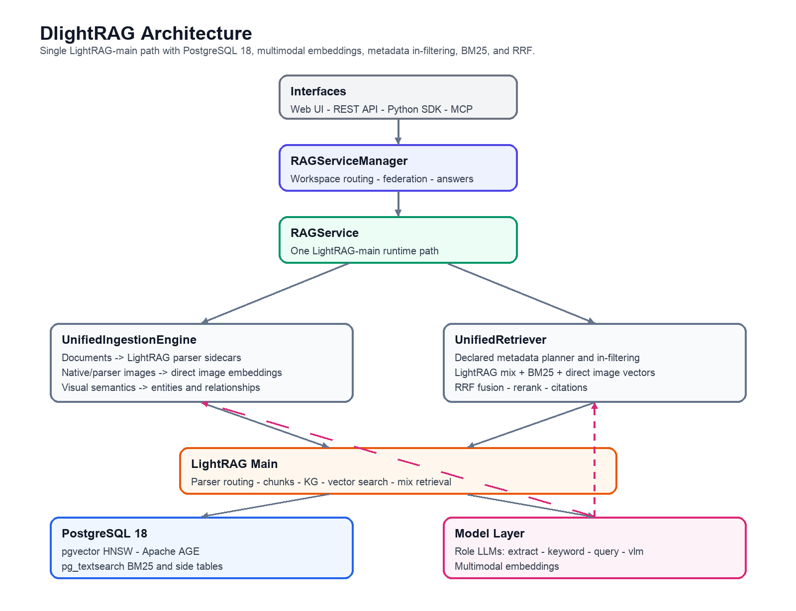
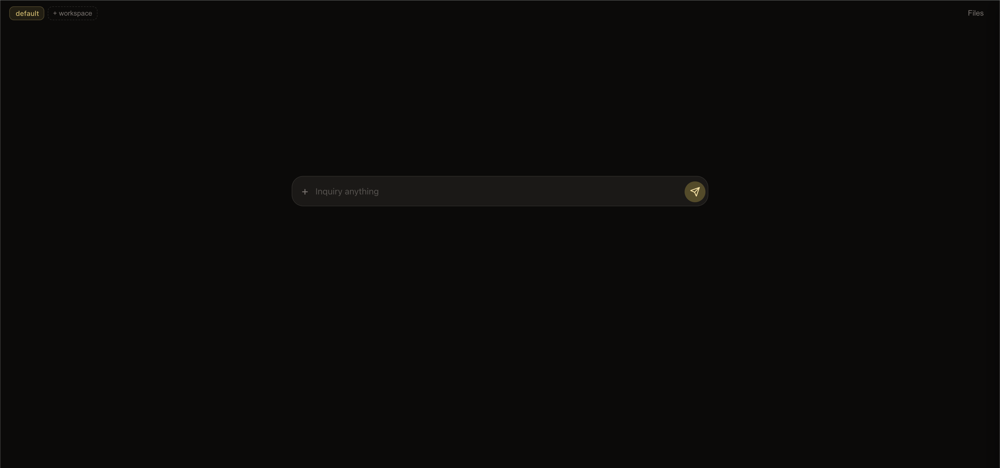

# DlightRAG

[](https://pypi.org/project/dlightrag/)
[](https://github.com/hanlianlu/dlightrag/actions/workflows/ci.yml)
[](https://deepwiki.com/hanlianlu/DlightRAG)

Multimodal RAG with knowledge graph intelligence. Understands what your documents say, how concepts connect, and what the pages look like. Production-ready.

DlightRAG goes beyond text-only vector search by combining knowledge graph understanding with multimodal retrieval. Two ingestion modes let you match the pipeline to your documents — text-heavy or visually rich. Answers come with inline citations grounded in actual document content.

## Features

- **Dual multimodal RAG modes** — Caption mode (parse → caption → embed) for pipeline-based multimodal paradigm; Unified mode (render → multimodal embed) for modern multimodal paradigm
- **Knowledge graph + vector + visual retrieval** — KG traversal and vector search via LightRAG, visual and filtering supplementary retrieval
- **Multimodal ingestion** — PDF, Word, Excel, PowerPoint, images from local filesystem, Azure Blob Storage, or Snowflake
- **Broad LLM support** — Any OpenAI-compatible LLM endpoint, plus [100+ providers](https://docs.litellm.ai/docs/providers) via LiteLLM
- **Cross-workspace federation** — Query across embedding-compatible workspaces with well managed merging
- **Citation and highlighting** — Inline citations with source, page, and highlighting attribution
- **Four interfaces** — Web UI, REST API, Python SDK, and MCP server


## Architecture

<p align="center">
  
</p>

<sub>Source: <a href="docs/architecture.drawio">docs/architecture.drawio</a></sub>


## Quick Start

> **Defaults:** `gpt-4.1` (chat) + `text-embedding-3-large` (embedding) via OpenAI. To use other providers or models, edit `config.yaml` — see [Configuration](#configuration).

### Web UI
##### Click the image to watch demo (YouTube)
<a href="https://www.youtube.com/watch?v=F1RXUW4Xfuc">
  
</a>

If you already have the REST API running (via Docker or `dlightrag-api`), the Web UI is available at:

```
http://localhost:8100/web/
```

Without Docker:

```bash
uv add dlightrag        # or: pip install dlightrag
cp .env.example .env    # set API keys in .env
dlightrag-api
```

### Docker (Self-Hosted)

```bash
git clone https://github.com/hanlianlu/dlightrag.git && cd dlightrag
cp .env.example .env    # set API keys in .env; edit config.yaml for models/providers
docker compose up
```

Includes PostgreSQL (pgvector + AGE), REST API (`:8100`), and MCP server (`:8101`).

> **Local models (Ollama, Xinference, etc.):** use `host.docker.internal` instead of `localhost` in `base_url` settings.

```bash
curl http://localhost:8100/health

curl -X POST http://localhost:8100/ingest \
  -H "Content-Type: application/json" \
  -d '{"source_type": "local", "path": "/app/dlightrag_storage/sources"}'

curl -X POST http://localhost:8100/retrieve \
  -H "Content-Type: application/json" \
  -d '{"query": "What are the key findings?"}'

curl -X POST http://localhost:8100/answer \
  -H "Content-Type: application/json" \
  -d '{"query": "What are the key findings?", "stream": true}'
```

### Python SDK

```bash
uv add dlightrag        # or: pip install dlightrag
cp .env.example .env    # set API keys in .env
```

```python
import asyncio
from dotenv import load_dotenv
from dlightrag import RAGServiceManager, DlightragConfig

load_dotenv()  # load .env

async def main():
    config = DlightragConfig()
    manager = RAGServiceManager(config)

    await manager.aingest(workspace="default", source_type="local", path="./docs")

    result = await manager.aretrieve(query="What are the key findings?")
    print(result.contexts)

    result = await manager.aanswer(query="What are the key findings?")
    print(result.answer)

asyncio.run(main())
```

> Requires PostgreSQL with pgvector + AGE, or JSON fallback for development (see [Configuration](#configuration)).

### MCP Server (for AI Agents)

```bash
uv tool install dlightrag   # or: pip install dlightrag
cp .env.example .env        # set API keys in .env
dlightrag-mcp
```

```json
{
  "mcpServers": {
    "dlightrag": {
      "command": "uvx",
      "args": ["dlightrag-mcp", "--env-file", "/absolute/path/to/.env"]
    }
  }
}
```

Tools: `retrieve`, `answer`, `ingest`, `list_files`, `delete_files`, `list_workspaces` — all with workspace isolation.


## API & Internals

| Method | Endpoint | Description |
|---|---|---|
| `POST` | `/ingest` | Ingest from local, Azure Blob, or Snowflake |
| `POST` | `/retrieve` | Contexts + sources (no LLM answer) |
| `POST` | `/answer` | LLM answer + contexts + sources (`stream: true` for SSE) |
| `GET` | `/files` | List ingested documents |
| `DELETE` | `/files` | Delete documents |
| `GET` | `/api/files/{path}` | Serve/download a file (local: stream, Azure: 302 SAS redirect) |
| `GET` | `/workspaces` | List available workspaces |
| `GET` | `/health` | Health check with storage status |

All write endpoints accept optional `workspace`; read endpoints accept `workspaces` list for cross-workspace federated search. Set `DLIGHTRAG_API_AUTH_TOKEN` in `.env` to enable bearer auth.

- **Request/response schema** — [`docs/response-schema.md`](docs/response-schema.md) for ingestion parameters, retrieval contexts, sources, media, SSE streaming, citations, and multimodal queries.
- **Retrieval & answer pipeline** — [`docs/retrieval_answer_mechanism.md`](docs/retrieval_answer_mechanism.md) for unified vs caption mode, visual resolution, reranking, Step 1+2 merge.


## Configuration

Configuration uses a hybrid system — structured app settings in [`config.yaml`](config.yaml), secrets and deployment in `.env`.

**Priority:** constructor args > env vars > `.env` > `config.yaml` > defaults

See [`config.yaml`](config.yaml) for all application settings and [`.env.example`](.env.example) for secrets/deployment reference.

> **Env var naming:** all variables use the `DLIGHTRAG_` prefix. Single underscore (`_`) is part of the field name (e.g. `DLIGHTRAG_POSTGRES_HOST` → `postgres_host`). Double underscore (`__`) means nested object (e.g. `DLIGHTRAG_CHAT__MODEL` → `chat.model`). See `.env.example` for details.

### RAG Mode

The first decision — determines your ingestion pipeline, model requirements, and retrieval behavior.

| Mode | Pipeline | Best for |
|------|----------|----------|
| `caption` (default) | Document parsing → VLM captioning → text embedding → KG | Text-heavy documents, structured elements |
| `unified` | Page rendering → multimodal embedding → VLM entity extraction → KG | Visually rich documents (charts, diagrams, complex layouts) |

**Caption mode parsers** (`parser` in config.yaml):

| Parser | Description |
|--------|-------------|
| `mineru` (default) | MinerU PDF parser — fast, good for text-heavy documents |
| `docling` | Docling parser — alternative structure-aware parser |
| `vlm` | VLM-based OCR — renders pages and uses chat model (must be VLM) to extract structured content; no external parser dependency |

All caption mode parsers use Docling's HybridChunker for structure-aware chunking.

**Model usage by stage:**

| Stage | Caption | Unified |
|-------|---------|---------|
| Image captioning | chat model (VLM) | chat model (VLM) |
| Table / equation captioning | chat model | — |
| Entity extraction | chat model | chat model (VLM) |
| Embedding | embedding model | embedding model (multimodal) |
| Rerank (llm backend) | ingest/chat model | chat model (VLM, pointwise scoring) |
| Rerank (API backend) | cohere/jina/aliyun API | cohere/jina/aliyun API |
| Answer generation | chat model | chat model (VLM, sees text excerpts + page images) |

> **Important:** The chat model must support vision (multimodal/VLM). It doubles as the vision model for image captioning, VLM parser, unified mode, and multimodal queries. A text-only chat model will fail on these tasks.

For unified mode, set `rag_mode: unified` in `config.yaml` and use multimodal models:

```yaml
# config.yaml
rag_mode: unified

chat:
  model: qwen3-vl-32b          # must support vision

embedding:
  model: Qwen3-VL-Embedding    # must be multimodal
  dim: 4096
```

> **Limitations:** Snowflake is text-only (no visual embedding). A workspace is locked to one mode after first ingestion. Page images ~3-7 MB/page at 250 DPI.

### Providers

Two-track dispatch — choose per model block in `config.yaml`:

| Provider | SDK | Use for |
|----------|-----|---------|
| `openai` (default) | AsyncOpenAI | OpenAI, Azure OpenAI, Qwen/DashScope, MiniMax, Ollama, Xinference, OpenRouter, any OpenAI-compatible endpoint |
| `litellm` | LiteLLM | Anthropic, Google Gemini, and everything else via [LiteLLM model prefixes](https://docs.litellm.ai/docs/providers) |

```yaml
# config.yaml — OpenAI-compatible (Ollama example)
chat:
  provider: openai
  model: qwen3:8b
  base_url: http://localhost:11434/v1

# config.yaml — LiteLLM (Anthropic example)
chat:
  provider: litellm
  model: anthropic/claude-sonnet-4-20250514
```

API keys go in `.env`:
```bash
DLIGHTRAG_CHAT__API_KEY=sk-...
DLIGHTRAG_EMBEDDING__API_KEY=sk-...
```

### Storage Backends

Set in `config.yaml`:

| Setting | Default | Options |
|---------|---------|---------|
| `vector_storage` | `PGVectorStorage` | PGVectorStorage, MilvusVectorDBStorage, NanoVectorDBStorage, ... |
| `graph_storage` | `PGGraphStorage` | PGGraphStorage, Neo4JStorage, NetworkXStorage, ... |
| `kv_storage` | `PGKVStorage` | PGKVStorage, JsonKVStorage, RedisKVStorage, ... |
| `doc_status_storage` | `PGDocStatusStorage` | PGDocStatusStorage, JsonDocStatusStorage, ... |

> **Note:** When using PostgreSQL backends, LightRAG maps its internal namespace names to different table names (e.g. `text_chunks` → `LIGHTRAG_DOC_CHUNKS`, `full_docs` → `LIGHTRAG_DOC_FULL`). DlightRAG's unified mode adds a `visual_chunks` table via its own KV storage.

### Workspaces

Each workspace has its own knowledge graph, vector store, and document index. `workspace` in config.yaml (default: `default`) is automatically bridged to backend-specific env vars — no manual setup needed.

| Backend type | Isolation mechanism |
|---|---|
| PostgreSQL (PG*) | `workspace` column / graph name in same database |
| Neo4j / Memgraph | Label prefix |
| Milvus / Qdrant | Collection prefix |
| MongoDB / Redis | Collection scope |
| JSON / Nano / NetworkX / Faiss | Subdirectory under `working_dir/<workspace>/` |

### Reranking

Set in `config.yaml` under the `rerank:` block:

| Setting | Default | Description |
|---------|---------|-------------|
| `rerank.backend` | `llm` | `llm`, `cohere`, `jina`, `aliyun`, `azure_cohere` |
| `rerank.model` | (backend default) | Model name sent to the endpoint |
| `rerank.base_url` | (provider default) | Custom endpoint URL for any compatible service |
| `rerank.api_key` | — | Set in `.env` as `DLIGHTRAG_RERANK__API_KEY` |

| Backend | Default model | API key |
|---------|---------------|---------|
| `llm` | (uses ingest/chat model) | (reuses chat/ingest key) |
| `cohere` | `rerank-v4.0-pro` | `DLIGHTRAG_RERANK__API_KEY` |
| `jina` | `jina-reranker-v3` | `DLIGHTRAG_RERANK__API_KEY` |
| `aliyun` | `qwen3-rerank` | `DLIGHTRAG_RERANK__API_KEY` |
| `azure_cohere` | `Cohere-rerank-v4.0-pro` | `DLIGHTRAG_RERANK__API_KEY` |

Point any backend at a local reranker (Xinference, etc.) via `rerank.base_url` + `rerank.model` in config.yaml.


## Development

```bash
git clone https://github.com/hanlianlu/dlightrag.git && cd dlightrag
cp .env.example .env && uv sync
docker compose up -d                # PostgreSQL + API + MCP
docker compose up postgres -d       # PostgreSQL only
```

```bash
uv run pytest tests/unit            # unit tests (no external services)
uv run pytest tests/integration     # integration tests (requires PostgreSQL)
uv run ruff check src/ tests/ scripts/ --fix && uv run ruff format src/ tests/ scripts/
```


## License

Apache License 2.0 — see [LICENSE](LICENSE).

---

Built by HanlianLyu. Contributions welcome!
