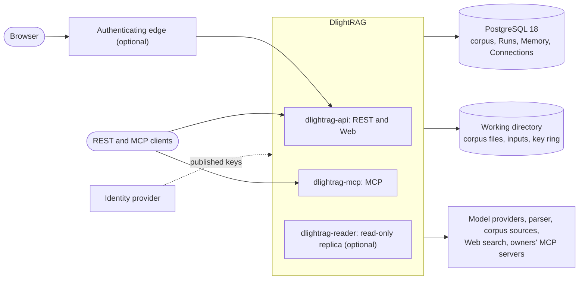

# DlightRAG

[](https://github.com/hanlianlu/dlightrag/actions/workflows/ci.yml)
[](https://deepwiki.com/hanlianlu/DlightRAG)

DlightRAG is a production multimodal RAG service built on LightRAG. It combines
knowledge-graph and vector retrieval with metadata filtering, BM25, visual
retrieval, reranking, citations, highlights, and durable agentic answers. The
same runtime is available through Web, REST, MCP, and an in-process Python API.

**Runtime:** Python ≥3.14.7 · PostgreSQL 18 ecosystem · Apache-2.0

LightRAG storage defaults are exactly `PGKVStorage`, `PGVectorStorage`,
`PGTableGraphStorage`, and `PGDocStatusStorage`. Writer deployments may
explicitly replace only the vector leg with `MilvusVectorDBStorage` (including
Milvus-compatible Zilliz endpoints) by installing `dlightrag[milvus]`; reader
processes use the PostgreSQL vector leg.

## Architecture


```mermaid
flowchart LR
  browser(["Browser"]) --> edge["Authenticating edge (optional)"] --> api
  clients(["REST and MCP clients"]) --> api & mcp
  subgraph dlightrag["DlightRAG"]
    api["dlightrag-api: REST and Web"]
    mcp["dlightrag-mcp: MCP"]
    reader["dlightrag-reader: read-only replica (optional)"]
  end
  idp["Identity provider"] -. "published keys" .-> dlightrag
  dlightrag --> pg[("PostgreSQL 18<br/>corpus, Runs, Memory, Connections")]
  dlightrag --> files[("Working directory<br/>corpus files, inputs, key ring")]
  dlightrag --> outside["Model providers, parser, corpus sources,<br/>Web search, owners' MCP servers"]
```

LightRAG supplies graph and vector retrieval. DlightRAG owns product policy,
multimodal alignment, durable ingestion and answers, security, storage adapters,
and public interfaces. Fast and Research answers share one durable conversation
tree; Research adds a per-run workspace, tools, memory, and child agents.
See [Architecture](docs/architecture.md) for module and storage ownership.

## Deployment Paths

| Path | PostgreSQL | Parser | Security |
|---|---|---|---|
| Local Docker | Compose PG18 | Self-hosted MinerU by default | Loopback, `auth_mode: none` |
| Native API | Compose or external PG18 | Any reachable MinerU or Docling | Local or explicit auth |
| Shared service | Managed or self-hosted PG18 | Independently operated parser | `jwt`; `simple` is one owner |
| Enterprise | Managed PG18 | Independently operated parser | `jwt` with Access Rules and workspace creators |

The parser runs outside the DlightRAG app container. The checked-in Docker
configuration uses self-hosted MinerU at
`http://host.docker.internal:8210`. Docling and MinerU cloud remain supported.

## Quick Start

Install [Docker + Compose](https://docs.docker.com/get-docker/),
[`uv`](https://docs.astral.sh/uv/), `git`, and `make`.

### Interactive setup

```bash
git clone https://github.com/hanlianlu/dlightrag.git
cd dlightrag
uv run prerequisite_setup.py
```

The wizard configures models, parser, secrets, and the local stack. It defaults
to self-hosted MinerU and is safe to rerun.

### Manual setup

```bash
git clone https://github.com/hanlianlu/dlightrag.git
cd dlightrag
cp .env.example .env
mkdir -p "${HOME}/.dlightrag/skills"
```

The last command prepares the default read-only operator Skills bind source;
when `COMPOSE_GLOBAL_SKILLS_DIR` selects another host path, create that directory
instead. Add the keys required by your `config.yaml` model blocks:

```bash
DLIGHTRAG_MODELS__CHAT__DEFAULT__API_KEY=...
DLIGHTRAG_MODELS__EMBEDDING__API_KEY=...
DLIGHTRAG_MODELS__CHAT__ROLES__EXTRACT__API_KEY=...
DLIGHTRAG_MODELS__CHAT__ROLES__KEYWORD__API_KEY=...
DLIGHTRAG_MODELS__CHAT__ROLES__QUERY__API_KEY=...
DLIGHTRAG_MODELS__CHAT__ROLES__VLM__API_KEY=...
DLIGHTRAG_MODELS__RERANK__API_KEY=...
```

Install and start MinerU, then start DlightRAG:

```bash
make mineru-install
make mineru-service-install  # installs and starts the background service
curl http://127.0.0.1:8210/health

docker compose up -d
docker compose ps
```

Open <http://localhost:8100/web/>. The stack publishes:

| Service | Address |
|---|---|
| REST API and Web | `http://127.0.0.1:8100` |
| MCP streamable HTTP | `http://127.0.0.1:8101` |
| PostgreSQL | `127.0.0.1:5432` |

Use `make mineru-api` when the platform cannot install a background user
service. To use Docling, replace the MinerU block in `config.yaml`; a commented
example is included there. Parser changes affect only new parses.

Configuration fields and parser operations are documented in
[Configuration](docs/configuration.md) and [Operations](docs/operations.md).

### Native API

Run PostgreSQL in Docker and the API on the host:

```bash
docker compose up -d postgres
uv sync
DLIGHTRAG_CORPUS__SIDECARS__MINERU__LOCAL_ENDPOINT=http://127.0.0.1:8210 \
  uv run dlightrag-api
```

The checked-in config is Docker-first, so a native process overrides the parser
host alias with loopback. Put local sources under
`./dlightrag_storage/inputs/<workspace>`; DlightRAG only reads them and keeps
its own corpus files under `./dlightrag_storage/corpus/<workspace>`.

### Read-only replica

A `reader` serves every read surface against the same database and refuses
corpus writes with HTTP 503 at acceptance
([Service roles](docs/postgresql.md#service-roles-and-shared-artifacts)):

```bash
docker compose --profile reader up -d dlightrag-reader
curl -s localhost:8102/health   # service_role: reader
```

## Use DlightRAG

### Web

The Web UI supports workspace and file management, durable Fast and Research
conversations, answer attachments, citations, source highlights, child-agent
status, and typed Answer Artifacts. Research publishes only workspace roots it
explicitly attaches; prose links alone never publish files. English, Chinese,
and automatic browser language modes are available under Settings.

### REST

Ingestion, Retrieval, and Answer create durable Runs and return `202 Accepted`.
Corpus mutations require a stable idempotency key.

```bash
INGEST_RUN=$(curl -sS -X POST http://localhost:8100/runs/corpus/ingest \
  -H "Content-Type: application/json" \
  -H "Idempotency-Key: ingest-report-1" \
  -d '{"source_type":"local","path":"report.pdf"}' | jq -r .run_id)
curl "http://localhost:8100/runs/$INGEST_RUN"

RETRIEVAL_RUN=$(curl -sS -X POST http://localhost:8100/retrieve \
  -H "Content-Type: application/json" \
  -d '{"query":"What are the key findings?"}' | jq -r .run_id)
curl "http://localhost:8100/runs/$RETRIEVAL_RUN"

RUN=$(curl -sS -X POST http://localhost:8100/answer \
  -H "Content-Type: application/json" \
  -d '{"query":"What are the key findings?"}' | jq -r .run_id)
curl -N "http://localhost:8100/runs/$RUN/events"
curl "http://localhost:8100/runs/$RUN"
```

See [Interfaces](docs/interfaces.md) for requests, responses, pagination, SSE,
attachments, citations, and all transport contracts.

### MCP

For a local stdio client:

```json
{
  "mcpServers": {
    "dlightrag": {
      "command": "uv",
      "args": ["run", "--directory", "/absolute/path/to/dlightrag", "dlightrag-mcp", "--env-file", "/absolute/path/to/dlightrag/.env"]
    }
  }
}
```

The Compose stack also exposes streamable HTTP on port 8101. MCP lets external
agents manage source-backed knowledge, delegate durable Retrieval and Answer
Runs, steer or continue research, and read its Artifacts. Its 18 tools cover
these tasks; personal Memory management, service administration, and direct
child-agent supervision are available through Web and REST. All interfaces
reuse the same Application services and authorization rules. See
[Interfaces](docs/interfaces.md#mcp-server) for the tool list.

### Python

There is no PyPI distribution: the runtime is consumed from a clone, where
`uv run` uses the locked environment.

```bash
git clone https://github.com/hanlianlu/dlightrag.git
cd dlightrag
uv sync
uv run python your_script.py
```

An application in its own project can add the clone as an editable path
dependency instead (`uv add --editable /absolute/path/to/dlightrag`); the Memory
workspace package resolves from the same clone.

Create an application with `create_application(config)`, use
`application.corpus_mutations` for durable corpus writes,
`application.retrieval` for durable Retrieval, and `application.answers` for
durable Answers, then call
`application.aclose()`. Complete typed examples are in
[Interfaces](docs/interfaces.md#in-process-application).

## Core Concepts

| Concept | Meaning | Reference |
|---|---|---|
| Workspace | Isolation unit for indexed data, metadata, files, and queries | [Domain language](docs/domain-language.md) |
| Ingestion | One durable contract for local files, uploads, object storage, URLs, and SDK sources | [Interfaces](docs/interfaces.md#ingestion) |
| Retrieval | One durable Query-lane Run returning LightRAG mix plus metadata, BM25, visual fusion, and rerank evidence | [Retrieval and Answer](docs/retrieval-answer.md) |
| Run | Common durable lifecycle for Retrieval, Answer, and Corpus Mutation across REST, MCP, Web, Python, and evaluation | [Run runtime](docs/run-runtime.md) |
| Answer Run | A Query-lane Run that resolves Fast or Research and generates an Answer | [Retrieval and Answer](docs/retrieval-answer.md#answer-orchestration) |
| Resource | Answer attachment or public link, read as bounded text or viewed as images on demand; later Runs in the same Session can adopt it | [Resource reading](docs/resource-reading.md) |
| Published Artifact | Owner-visible Research output authorized by a settled root attachment and validated at publication | [Domain language](docs/domain-language.md) |
| Source | Durable provenance and download contract for an ingested document | [Interfaces](docs/interfaces.md#sources) |

## Security

Loopback development can use `access.auth_mode: none`. A deployment for one
owner uses `simple`, a bearer token; one shared by several people uses `jwt`,
where an issuer and an audience verify each person's token and Access Rules and
workspace creators decide what they may do. DlightRAG does not issue tokens or
replace an ingress WAF, rate limiter, TLS terminator, or identity provider. See
[Security](docs/security.md).

## Development

```bash
uv sync
npm --prefix frontend ci
make hooks
make ci          # lint, security, format, types, architecture, frontend, unit
make ci-full     # plus integration tests
make ci-e2e      # plus E2E smoke
```

Use [Operations](docs/operations.md) for reset, rebuild, parser, Langfuse, and
maintenance runbooks. RAGAS evaluation is documented in
[Evaluation](docs/evaluation.md).

## Documentation

| Document | Owns |
|---|---|
| [Architecture](docs/architecture.md) | Runtime ownership, flows, storage topology, layering |
| [Domain Language](docs/domain-language.md) | Canonical product vocabulary |
| [Configuration](docs/configuration.md) | Configuration precedence, fields, defaults, examples |
| [Interfaces](docs/interfaces.md) | Python, REST, MCP, and Web contracts |
| [Retrieval and Answer](docs/retrieval-answer.md) | Retrieval, fusion, rerank, packing, citations, highlights |
| [Run Runtime](docs/run-runtime.md) | Run lifecycle, lanes, admission limits, repair, retention, scaling |
| [Personal MCP Connections](docs/personal-mcp-connections.md) | Owner-managed MCP Connections, authorization, and their binding into Research Runs |
| [Answer Resource Reading](docs/resource-reading.md) | `read`/`view` contracts for Answer attachments and Resources, conversion routes |
| [Security](docs/security.md) | Authentication, authorization, ingress and content boundaries |
| [PostgreSQL](docs/postgresql.md) | PostgreSQL requirements, schema ownership, tuning |
| [Operations](docs/operations.md) | Executable runbooks and recovery workflows |
| [Observability](docs/observability.md) | Trace structure, span vocabulary, attribution, redaction, deployment labels |
| [Evaluation](docs/evaluation.md) | RAGAS workflow |
| [Web Theme Design](docs/web-theme-design.md) | Web appearance and interaction decisions |

ADRs under `docs/adr/` record design decisions; they are not required reading for
operating DlightRAG.

## License

Apache License 2.0. See [LICENSE](LICENSE).

Built by HanlianLyu. Contributions welcome.
