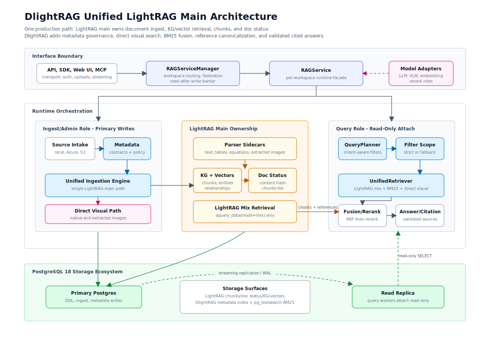

# Architecture

This page is for readers who need to understand DlightRAG's runtime boundaries.
It owns the product architecture, the LightRAG/DlightRAG responsibility split,
the storage topology, and the code-layering rule. Interface contracts live in
[interfaces.md](interfaces.md); retrieval internals live in
[retrieval-answer.md](retrieval-answer.md); PostgreSQL deployment details live
in [postgresql.md](postgresql.md).

<p align="center">
  
</p>

## Runtime Ownership

```text
Clients
  -> REST / Web / MCP / SDK adapters
  -> RAGServiceManager
       workspace routing, user scope, federation, read-after-write barriers
  -> RAGService
       one workspace runtime, ingest, retrieve, answer, reset
  -> LightRAG main
       parser routing, staged ingest, chunks, doc status, KG, vectors
  -> DlightRAG PostgreSQL stores
       metadata index, BM25 indexes, workspace/job/checkpoint metadata
```

LightRAG remains the core RAG engine. It owns parser routing, staged ingest,
document chunks, document status, vector storage, and the knowledge graph.
DlightRAG adds product-layer source staging, metadata governance, durable ingest
jobs, PostgreSQL BM25, direct image-vector alignment, answer orchestration,
citations, REST, Web, SDK, and MCP interfaces.

DlightRAG does not reimplement LightRAG parser sidecars, document status, KG
extraction, or LightRAG `mix` retrieval.

## Ingestion Flow

```text
source file or upload
  -> DlightRAG source staging and metadata normalization
  -> LightRAG parser routing
       native route for DOCX, Markdown, and textpack inputs
       MinerU-compatible route for configured sidecar document formats
  -> LightRAG staged ingest
       chunks, multimodal semantic text, KG entities/relations, vector rows
  -> DlightRAG post-ingest maintenance
       active direct image embedding overwrites canonical LightRAG drawing chunk vectors
       chunk language labels update BM25 partial indexes
       declared metadata updates filterable columns
```

Source files and parser-extracted images both go through LightRAG's multimodal
path. When the configured embedding provider supports image inputs and the
startup probe succeeds, DlightRAG aligns the existing canonical LightRAG visual
chunk with a raw image embedding. With a text-only embedding model, this
alignment is skipped and LightRAG's semantic visual chunk remains the
multimodal ingestion path.

## Retrieval And Answer Flow

```text
query
  -> query planning and optional metadata filter inference
  -> strict metadata in-filtering when filters are explicit
  -> LightRAG mix retrieval
  -> direct query-image retrieval when image embedding is active
  -> pg_textsearch BM25 over the same candidate scope
  -> RRF fusion
  -> provenance hydration and final rerank
  -> answer packing with citations, bounded images, and optional highlights
```

DlightRAG uses LightRAG `mix` as the base retrieval mode. The DlightRAG hybrid
layer is the combination of LightRAG `mix`, metadata filtering, pg_textsearch
BM25, direct image retrieval, RRF fusion, hydration, reranking, and answer
packing.

Use [retrieval-answer.md](retrieval-answer.md) for the detailed retrieval,
filtering, reranking, citation, and multimodal-answer behavior.

## PostgreSQL Topology

DlightRAG has one application-level PostgreSQL endpoint. REST, Web, MCP, and
SDK surfaces all use the same configured write-capable endpoint, and LightRAG's
staged pipeline supports ingest and query in the same service process.

Core storage is PostgreSQL 18:

| Component | Backend |
|---|---|
| Vector store | `PGVectorStorage` with pgvector |
| Graph store | `PGGraphStorage` with Apache AGE |
| KV store | `PGKVStorage` |
| Document status | `PGDocStatusStorage` |
| BM25 | pg_textsearch |

If production infrastructure uses managed read replicas, keep that routing in
the PostgreSQL, proxy, or platform layer. DlightRAG does not expose separate
query/runtime database roles or read-replica credentials.

## Code Layering

Modules sit on a decreasing dependency stack: a module at a higher layer may
import from lower layers, but lower layers must not import higher ones.

```text
L9  api, mcp, web                                  interface adapters
L8  core.servicemanager                            multi-workspace coordinator
L7  core.{service, reset}                          per-workspace facade
L6  core orchestration                             ingest, retrieve, answer, visual assets
L5  LightRAG/store adapters                        patches, parser sidecar, BM25, filtered VDB
L4  models and shared retrieval helpers            embedding, LLM, rerank, metadata path
L3  providers, storage, sourcing, citations        external/domain implementations
L2  config, schemas, scope, protocols              shared contracts
L1  observability                                  Langfuse wrappers and no-op fallback
L0  prompts, utils                                 pure helpers
```

The layering checks are part of local and CI verification:

```bash
uv run lint-imports
uv run python scripts/ci/check-architecture.py
```
