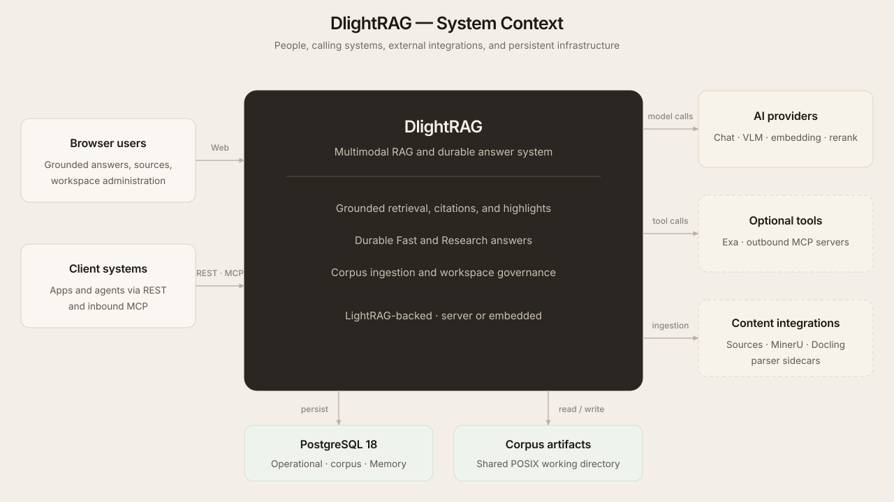
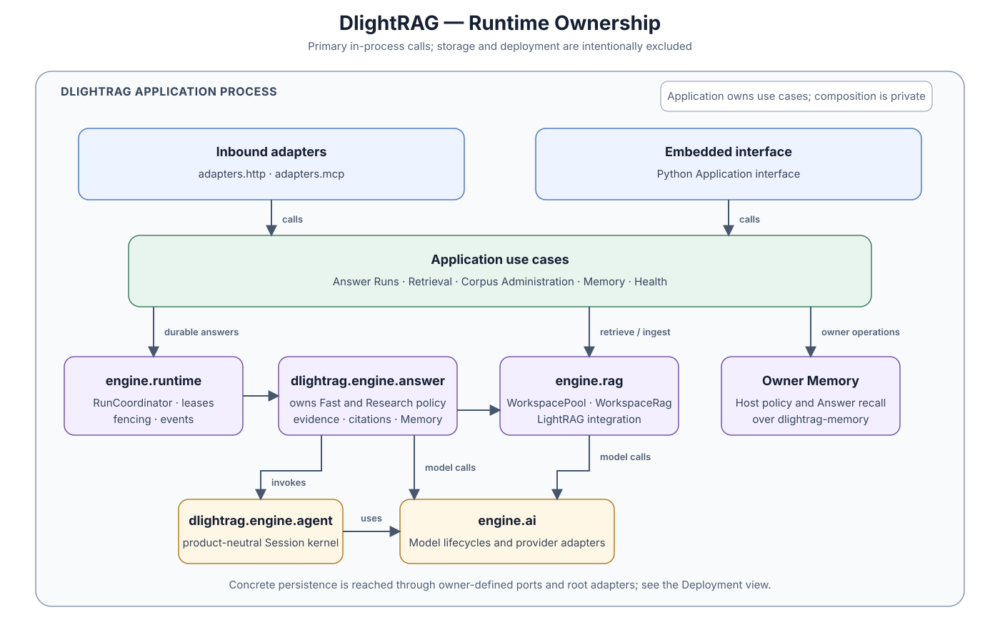
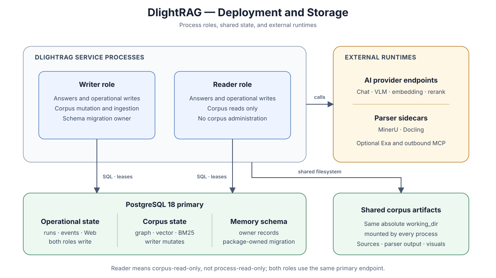
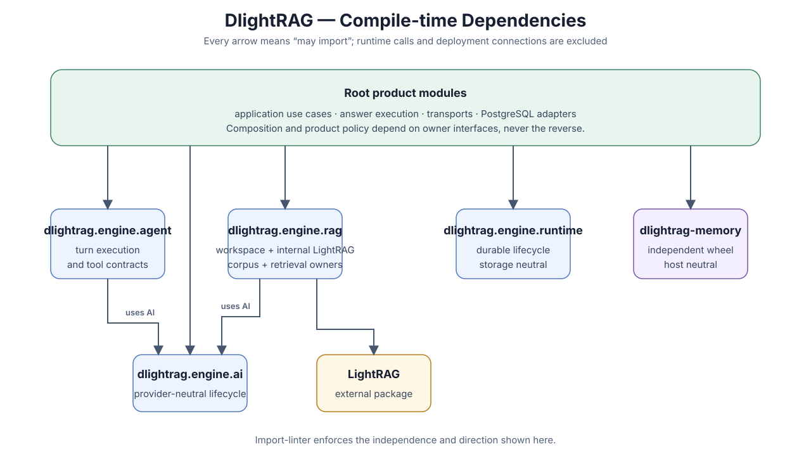

# Architecture

This page is for readers who need to understand DlightRAG's runtime boundaries.
It owns the product architecture, the LightRAG/DlightRAG responsibility split,
the storage topology, and the code-layering rule. Canonical product terms live
in [domain-language.md](domain-language.md); interface contracts live in
[interfaces.md](interfaces.md); retrieval internals live in
[retrieval-answer.md](retrieval-answer.md); PostgreSQL deployment details live
in [postgresql.md](postgresql.md).

## System Context

<p align="center">
  
</p>

This view answers only who uses DlightRAG and which external systems it reaches.
LightRAG, the Agent loop, and provider adapters are in-process implementation;
they are deliberately absent here. Optional integrations have dashed borders.

The page uses four independent architectural viewpoints. An arrow keeps exactly
one meaning inside each figure:

| View | Question | Arrow meaning |
|---|---|---|
| System context | Who uses the system and what surrounds it? | System interaction |
| Runtime ownership | Which in-process module owns each behavior? | Primary runtime invocation |
| PostgreSQL topology | Where do processes and state live? | Cross-runtime or storage connection |
| Code layering | Which module may import which? | Allowed import direction |

Fast/Research branching, ingestion, retrieval, and run recovery are dynamic
flows. They stay in their owning sections rather than being mixed into a static
architecture overview.

## Runtime Ownership

<p align="center">
  
</p>

`Application` is the eager composition and lifecycle root, not a request stage.
Inbound adapters call typed application services. Those services invoke the
small owner interfaces of Runtime, Answer, RAG, and Memory. Agent and RAG both
use the provider-neutral AI module without depending on each other. Persistence
is omitted from this view and shown under
[PostgreSQL Topology](#postgresql-topology).

LightRAG remains the core RAG engine. It owns parser routing, staged ingest,
document chunks, document status, vector storage, and the knowledge graph.
DlightRAG adds product-layer source staging, metadata governance, durable ingest
jobs, PostgreSQL BM25, fused visual-vector alignment, answer orchestration,
citations, REST, Web, SDK, and MCP interfaces.

DlightRAG does not reimplement LightRAG parser sidecars, document status, KG
extraction, or LightRAG `mix` retrieval.

## Ingestion Flow

```text
source file or upload
  -> DlightRAG source staging and metadata normalization
  -> LightRAG parser routing
     one internal wildcard derived from the configured MinerU or Docling block
     unsupported engine/suffix combinations use LightRAG native/legacy fallback
  -> LightRAG staged ingest
       chunks, multimodal semantic text, KG entities/relations, vector rows
  -> DlightRAG post-ingest maintenance
       active fused text+image embedding overwrites canonical LightRAG drawing chunk vectors
       chunk language labels update BM25 partial indexes
       caller metadata updates the document metadata row
```

Source files and parser-extracted images both go through LightRAG's multimodal
path. When the configured embedding provider is a unified multimodal model and
the startup probe succeeds, DlightRAG aligns the existing canonical LightRAG
visual chunk with a fused vector that interleaves the VLM description and the
image. With a text-only embedding model, this alignment is skipped and
LightRAG's semantic visual chunk remains the multimodal ingestion path.

Parser adapters converge on LightRAG's shared IR and sidecars. DlightRAG does
not branch on MinerU versus Docling after that boundary. That derived parser
policy drives durable workspace ingestion only. Tables and equations remain
structured text evidence, while successful drawings use the shared VLM and
fused-vector path. MinerU and Docling are the only durable ingestion parsers,
and the temporary Answer resource path never invokes them.

## Answer Resource Flow

Every answer runs through one `AnswerOrchestrator`. Public callers attach files
and HTTPS references as **answer attachments**; the same contract is used by
REST, the Python SDK, MCP, and the Web UI. Attachments become request-local
resources for the lifetime of one answer and are never promoted into a
workspace, LightRAG storage, or a durable cache:

```text
answer request (query + optional attachments + mode auto|fast|research)
  -> Access + capability → Valid Mode Set; Prepared Input pins profiles
  -> Routing Record stores requested / valid / nullable resolved mode
  -> Fast invocation: planner + retrieval + shared Context/Evidence/model/usage
       no Agent Session, workspace, tools, or publication
  -> Research: product-neutral AgentLoop over the selected linear journal head
       Context Contributions project conversation, working state, Evidence,
       Profile Memory, Skills metadata, and trusted extension context
       run-local ToolRegistry exposes every configured tool
       foreground spawn_agent children inherit tools except spawn, run in
       parallel under the parent lease, and adopt citable Evidence atomically
       explicitly referenced outputs publish as typed Artifacts; one non-blank
       report.md, report.html, or report.pdf may hold the Primary Report role
```

The execution setting is exactly `disabled | trust | sandbox`. Trust binds a
rooted local adapter; Bash is intentionally host/network capable while rooted
file tools reject traversal and symlink escape. Sandbox is only an adapter seam
and fails explicitly when no trusted backend is installed. The access scheduler
uses Path, Workspace, and External claims: Bash conflicts with workspace file
operations but not independent retrieval. Trusted Python extensions may only
register tools, contribute context, or supply an execution adapter.

Skills are progressively disclosed from `~/.agents/skills/` and the Agent
Workspace `.agents/skills/`; initial context carries metadata only and
`load_skill` reads contained files on demand. Deployment-declared outbound MCP
endpoints become thin foreground tools with explicit allowlists; no registry,
OAuth service, or management plane is introduced.

Resource reads are deterministic first. `read` decodes UTF-8/CSV text
directly and converts HTML, PDF, DOCX, PPTX, and XLSX through selected MarkItDown
converters with plugins disabled and no network access; OOXML archives pass a
zip-bomb preflight before any converter opens them. `inspect` performs
focused visual inspection through the VLM role (falling back to the default
LLM), rasterizing PDFs off the event loop and bounding images through the one
canonical image path. Every visual observation is marked as VLM-derived evidence
with its exact source/page/sheet/cell locator, so the model cites where a claim
came from and never treats a description as the final answer.

Current image attachments reach the research agent and final generation as
bounded image blocks, while the same verified bytes remain request-local
resources for optional focused evidence. If the agent selects a knowledge-base
search, one VLM description and the raw image feed that retrieval's text and
direct-visual legs; no KB call means no query-image planning work. A source-image
inspection sends the bounded whole image with a concrete focus; it does not crop
or zoom an arbitrary region.
Structural zoom-in is available for a selected PDF page or an extracted embedded
visual handle. The control prompt tells the model not to repeat inspection for a
general description when the current image is already visible.

Full resource bytes never enter model context. Only bounded text windows, capped
tool observations, and budgeted image blocks do. Every reachable model endpoint
has an immutable `ModelProfile`: context window (`C`), optional provider input
limit (`I`), optional output limit (`O`), and capability flags. Facts resolve by
normalized provider/model/endpoint identity from an explicit root override, a
trusted adapter, or the versioned AI catalog; an unknown identity fails closed.
The revisioned `ContextPolicy` reserves output, observation, safety, retained
tail, episodic continuation, and minimum input directly from the pinned model
facts. Its provider input ceiling is `min(I if known else C, C)`; output is
bounded independently by the provider output limit and physical remaining
context. Evidence, resource windows, history, tool schemas, and observations
consume the measured residual rather than nested percentages.

`RetrievalPlanner` is an internal node of the canonical retrieval operation; the
answer workflow never creates or injects a plan. It never receives attachment
bytes, converted attachment text, or resource manifests. Fast answers give
retrieval the bounded prior turns so the planner can resolve references. Public
retrieve calls are history-free. Research KB tool calls receive the one pinned
history projection, but `preserve_query` keeps their caller-chosen semantic query
unchanged while lexical terms, inferred metadata filters, and optional
current-image hints are derived. Explicit filters and BM25 terms remain
authoritative.

Workspace resolution stays at each interface's Access boundary. Retrieval starts cold
workspace initialization before retrieval planning for retrieve-only, fast-answer,
and research-answer requests; the later retrieval joins those same services.

Research control turns receive identity, tool-selection policy, trust
boundaries, and stopping rules. The last no-tool assistant text is the answer;
citation/source finalization is deterministic and never makes a hidden second
LLM call. Fast never enters the AgentLoop, but uses the same model-call,
Context Contribution, Evidence identity, citation, Profile Memory, and usage
infrastructure without fabricating an Agent Session.

When `answer.web_search.api_key` (Exa) is set, Exa Search is an optional peer
capability. Its passages belong to no workspace and are packed beside corpus
evidence; evidence-producing result URLs become inert request-local resource
handles that the model may deep-read with `read`. Exa Contents is not a
peer tool: it is a bounded internal fallback only when a selected public URL
cannot be read directly. A missing key removes both capabilities.

## Durable Answer Runs

Every answer — REST, MCP, Web, Python SDK, CLI, and evaluation — is one durable
run with one identifier and one lifecycle owned by PostgreSQL. `POST /answer`
validates, persists, and returns HTTP 202; the run outlives its creating request,
and a disconnected client only detaches.

```text
create (202)  -> run row + routing row + Prepared Input + blobs (one txn)
claim         -> FOR UPDATE SKIP LOCKED, fencing epoch++, lease heartbeat
execute       -> phase progress, coalesced token batches, journal / Fast stages
finish        -> canonical result + exactly one terminal event, same txn
recover       -> expired lease reclaimed; journal fold or Fast stage replay
```

A process restart folds the canonical Research journal. Its immutable entries
form a parent-linked in-memory view of the selected linear head; durable
alternate Session heads are not a 3.0 feature. Fast instead replays unfinished
stages. Interrupted generation emits `reset` and
regenerates from pinned input. Ordered steer controls are journaled before
acknowledgement; follow-up and fork create ordinary runs with parent lineage.
See [durable-answer-runs.md](durable-answer-runs.md) for the contract and
[postgresql.md](postgresql.md#durable-answer-run-state) for the schema.

`dlightrag.runtime` owns the storage-neutral records, store protocol,
subscription, coordinator, fenced session, and caller-wait failures. It imports
neither Answer policy nor PostgreSQL. The Answer executor classifies product
errors into `RunExecutionError` before they cross that boundary;
`dlightrag.adapters.postgres.answer_runs.PGAnswerRunStore` implements the runtime
store port.

`dlightrag.rag` owns the coherent `WorkspaceCorpusBackend` bundle:
coordination and maintenance, durable ingest jobs, plus a runtime binder for
metadata, chunk, filtered-vector, and BM25 stores. The root PostgreSQL adapter
implements those ports and hides environment translation, server/version/
extension checks, advisory-lock lifetimes, reader attachment, catalog scans,
workspace maintenance, schema DDL, and SQL identifiers. Startup availability
failures are translated to corpus errors; operation-specific failures retain
their adapter context for the current product error policy.
The current `Application` composes the adapter; the internal RAG module,
Runtime, status routes, API, Web, and MCP never import it. Corpus and operational
pools remain separate even when they use the same endpoint.

## Web Frontend Ownership

The browser shell has three explicit owners. Vite owns `frontend/index.html`,
the paste-token login entry, pre-paint theme initialization, and hashed build
assets. Light-DOM Lit components own application composition and typed browser
presentation. FastAPI serves only the two page routes, static/support assets,
and the same-origin `/web/api/*` command/query/SSE boundary. There is no Jinja
or HTMX composition path and no backend-generated ordinary UI fragment.

Browser state is split by lifetime rather than collected in one store. The
History API route is the active-conversation authority; focused stores own
conversation, workspace, attachment, ingest, and Answer-run state. The Lit-native
Chat Feature composes its Message List and Composer while one RunController owns
SSE replay/resume, reconnect timers, cancellation, and reader aborts. Internal
adapters retain DOMPurify, MathJax, Mermaid, object URLs, and split integration.
Server-sanitized semantic answer/source HTML is the only deliberate same-DOM HTML
sink. Artifact Canvas owns typed Artifact renderer selection and focus; active
HTML is fetched as authenticated inert bytes and placed in `srcdoc` only after
explicit consent, inside an opaque-origin iframe that is destroyed on close or
switch. Filenames, controls, links, galleries, panels, and system states remain
typed values rendered by Lit.

DlightRAG's Utopia/Mineral tokens remain the visual authority. The production
uses only Web Awesome's Split Panel component, imported directly without its
default theme and wrapped by DlightRAG persistence, clamping, accessibility,
and compact-layout behavior. Nested split panels preserve simultaneous Artifact
Canvas and Sources on wide layouts. Below 1200px the primary app remains a full-width
fixed layer under the native backdrop while the active panel retains modal
focus/inert semantics. Drawer and Dialog components were deliberately rejected;
the existing native overlays use the same semantic geometry tokens.

Frontend verification is layered: pure API/store/router/token rules run under
Node, Lit and CSS behavior runs in Chromium through Web Test Runner, integrated
page and accessibility behavior runs in Playwright, and every distributable
wheel is smoke-tested with the Vite build included.

## Web Conversation Boundary

The browser channel wraps the same durable runs with a principal-scoped
conversation lifecycle. A conversation owns navigation and history only: each
turn is one row linking to the Answer run that owns the request input, the
uploaded bytes, the streamed events, and the canonical result. The turn is
inserted inside the run's own creation transaction, so history exists before the
202 response.

Uploaded answer attachments are stored once as owner-scoped content-addressed
chunked blobs in `dlightrag_blobs`/`dlightrag_blob_chunks` and referenced by
`dlightrag_answer_run_artifacts`; there is no Web-owned raw attachment table, no
parsed-chunk table, and no vector cache. Historical attachments are re-registered
lazily as request-local resources on every follow-up, newest first up to the
available attachment-count limit. An attachment-bearing conversation therefore
remains on the research path. Browser thumbnails are derived on demand. Manual
deletion and the shared `answer.runtime.answer_run_retention_days` floor (default 365,
counted from `finished_at`) delete the linked runs, cascade their events and
references, and release blobs no surviving run references; a conversation row
whose last turn aged out is reclaimed by the empty-conversation sweep.

## Retrieval And Answer Flow

```text
query
  -> query planning and optional metadata filter inference
  -> strict metadata in-filtering when filters are explicit
  -> LightRAG mix retrieval
  -> direct image->image retrieval when fused visual embedding is active
  -> pg_textsearch BM25 over the same candidate scope
  -> RRF fusion
  -> provenance hydration and final rerank
  -> answer packing with citations, bounded images, and optional highlights
```

DlightRAG uses LightRAG `mix` as the base retrieval mode; the steps shown
around it form the DlightRAG hybrid layer.

Use [retrieval-answer.md](retrieval-answer.md) for the detailed retrieval,
filtering, reranking, citation, and multimodal-answer behavior.

## PostgreSQL Topology

<p align="center">
  
</p>

This deployment view shows process and storage connections only. Logical store
ownership is separated inside PostgreSQL even though the current deployment
uses one primary endpoint.

DlightRAG uses one PostgreSQL endpoint per service process. A writer process (the
default) serves REST, Web, MCP, and SDK operations and owns schema migrations.
A `reader` process is **corpus-read-only, not process-read-only**: it may create
and execute answer runs and write DlightRAG operational state (runs, events,
artifacts, Web conversations), while `CorpusAdmin` rejects ingestion, workspace
creation/reset, metadata mutation, retry, and deletion. Both roles
therefore use the same primary endpoint; DlightRAG makes no physical-standby or
read-endpoint promise.

Core storage is PostgreSQL 18:

| Component | Backend |
|---|---|
| Vector store | `PGVectorStorage` with pgvector |
| Graph store | `PGTableGraphStorage` (plain tables) |
| KV store | `PGKVStorage` |
| Document status | `PGDocStatusStorage` |
| BM25 | pg_textsearch |

Every process serving KB images or source downloads must see the same POSIX
artifact tree at the same absolute `deployment.working_dir` path. See
[postgresql.md](postgresql.md#service-roles-and-shared-artifacts) for the
complete role, migration-order, and shared-artifact contract.

## Code Layering

The repository is one UV workspace with two lockstep distributions. The root
wheel contains three internal deep modules plus the storage-neutral durable
Runtime; their import direction remains machine-enforced. Independently
installable Memory remains a separate distribution seam:

<p align="center">
  
</p>

This is the only figure whose arrows mean compile-time dependency. The arrow
points from the importing module to the module it may import; it says nothing
about runtime sequencing or deployment.

Agent and RAG may depend on AI but not on product modules or each other. RAG
owns its direct LightRAG dependency and never imports concrete PostgreSQL
adapters. The root product is batteries-included: all provider and source SDKs
are direct dependencies, while provider modules remain lazy imports. Memory
imports no root, AI, Agent, or RAG module; it declares `asyncpg` directly and
owns the independent `dlightrag_memory_records` schema and migration path. Root
`LangfuseTelemetry` is injected into internal model operations; standalone
Memory has no telemetry dependency.

Configuration follows the same ownership direction. `DlightragConfig` has
exactly eight operator-facing sections and directly composes deeply frozen
Pydantic settings from the lowest owning module: AI owns model, embedding, and
rerank settings; RAG owns corpus settings; root modules own product-only
sections. Runtime code consumes those canonical values or narrow derived
policies—there is no second dataclass snapshot of model or corpus fields. The
3.0 schema is strict: removed Agent aliases, flat YAML, and old environment
names are rejected rather than emulated.

### Memory package surface

`dlightrag-memory` is host-neutral and independently installable. Storage is
its own PostgreSQL schema (`dlightrag_memory_records`) with its own migration
registry; PG is the only backend (`--dsn`), no SQLite. Recall fuses RRF(k=60)
over exact (normalized btree), sparse (pg_textsearch BM25, both textsearch
configs merged by best score), and dense (opt-in TextEmbedder) legs; time
never enters the score — exact matches pin first, the rest follow
chronologically, and no threshold means an empty result is simply not
injected. Transport is `dlightrag-memory-mcp`, a stdio-only MCP server: the
subject is bound at launch and never accepted from a tool argument, a
launched server is authorized for its subject, and exactly four tools exist
— `memory_recall(query)`, `memory_remember(kind, body, idempotency_key,
supersedes_id?)`, `memory_forget(memory_id | body, idempotency_key)`, and
`memory_undo(change_id, idempotency_key)` — with no browse, no observe, and no
HTTP. Every mutation returns a replay-stable operation receipt. The package-owned
operation journal commits idempotency, mutation limits, record transitions, and
compensating undo through one atomic storage seam; forget writes a tombstone.
Eligibility and rendering stay host
concerns: the package never judges auth mode or renders prompts. DlightRAG binds
a JWT owner or stable local single-user owner, rejects shared simple-auth
personalization, and places recalled facts as low-authority non-citable context.
DlightRAG's owner setting is a hard capability gate: when inactive, acceptance
reserves no Memory capacity, Answer composes no Memory prompt or tools, and all
record operations are unavailable except reading or changing the setting. A
monotonic owner epoch invalidates already-running mutation hosts after deactivate
or physical Clear.

Inside the root product, modules still sit on a decreasing dependency stack: a
module at a higher layer may import from lower layers, but lower layers must not
import higher ones.

```text
L9  api, mcp, web                                  interface adapters
L8  application; services                         composition and use cases
L7  dlightrag.rag.WorkspacePool, WorkspaceRag      corpus runtime ownership
L6  answer                                         execution, lifecycle, source/media projection
L5  host and storage adapters                      PostgreSQL; LightRAG contract and lifecycle
L4  workspace cores and model adapters             AI; Agent; RAG retrieval, ingestion, sourcing
L3  product domain                                 access, requests, citations, conversations
L2c application, runtime                           health and durable lifecycle contracts
L2b model settings, schemas                        resolved foundation values
L2a config, scope, protocols                       shared configuration and contracts
L1  observability                                  Langfuse telemetry adapter
L0  prompts, utils                                 pure helpers
```

The layering checks are part of local and CI verification:

```bash
uv run lint-imports
```

`lint-imports` enforces contracts over the root and Memory distributions plus
the internal AI, Agent, and RAG module seams: AI cannot import product, Agent,
RAG, LightRAG, PostgreSQL, or transport modules; Agent may use AI but not
product/RAG/storage/transport code; and RAG may use AI and LightRAG APIs but
cannot import product, Agent, PostgreSQL, or transport modules. Existing root
contracts continue to
keep `api`/`mcp`/`web` out of internal modules, order the foundation and core
coordination stacks, keep Runtime free of Answer/RAG/storage/transport code,
make status routes depend only on `ApplicationHealth`, and separate resources
from model-visible tool adapters.
The same checks run against installed wheel contents so an editable workspace
cannot hide an undeclared dependency; that artifact gate also rejects imports
of LightRAG's concrete PostgreSQL backend, whose external submodule path cannot
be represented by import-linter.
