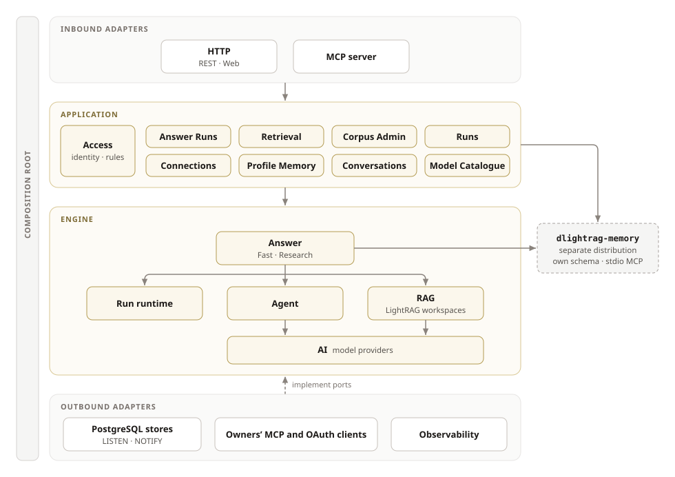

# Architecture

This document owns DlightRAG's runtime boundaries, the LightRAG/DlightRAG
responsibility split, browser ownership, deployment topology, and code layering.
The [README](../README.md#architecture) shows the system and its neighbours. See
[Domain Language](domain-language.md) for terms, [Interfaces](interfaces.md) for
contracts, [Security](security.md) for trust boundaries, and
[Retrieval and Answer](retrieval-answer.md) for query behavior.

## Runtime Ownership



Arrows are imports the [import contracts](#code-layering) allow, and the
composition root wires every layer. Inbound HTTP and MCP adapters call
Application use cases; a trusted embedding caller enters the public
`create_application` facade directly. Outbound adapters implement narrow ports
owned by Application or Engine, so a call through a port never imports its
concrete adapter.

`create_application` enters the private composition root, which constructs one
`Application`, injects concrete adapters and operation executors, and leaves the
runtime path. `Application` owns Access, configuration, lifecycle, health,
product use cases, and service projections. HTTP and MCP lifespans bind one
started instance; importing a transport or tool module never composes a fallback
service.

Inside Engine, Runtime, Answer, RAG, Agent, and AI are sibling owners. Answer
depends on Runtime, RAG, Agent, AI, and the Memory package; RAG and Agent depend
on AI; Runtime imports neither Answer nor RAG. Answer, Retrieval, and Corpus
Mutation services accept top-level work through the Run runtime, which owns
lifecycle, fencing, events, capacity, and dispatch for every lane
([Run runtime](run-runtime.md)). Answer-internal retrieval calls the same raw
Retrieval Stage directly rather than creating a nested Run. Engine RAG alone owns
the LightRAG dependency.

### LightRAG Versus DlightRAG

| LightRAG owns | DlightRAG adds |
|---|---|
| Parser routing and staged ingest | Source staging and metadata governance |
| Document chunks and status | Durable Corpus Mutation, Retrieval, and Answer Runs |
| Vector store and knowledge graph | PostgreSQL BM25 and RRF fusion |
| `mix` retrieval | Filtered/federated retrieval and direct visual alignment |
| Multimodal chunk analysis | Answer orchestration, resources, citations, and artifacts |
| Core RAG data model | REST, MCP, Web, and Application interfaces |

DlightRAG does not reimplement parser sidecars, document status, KG extraction,
or LightRAG `mix` retrieval.

## Core Flows

### Ingestion

```text
source
  -> DlightRAG staging + metadata normalization; publish readiness=false
  -> LightRAG parser routing (MinerU or Docling wildcard; native fallback)
  -> LightRAG staged ingest (chunks, KG, vectors, document status)
  -> required DlightRAG maintenance (fused visual vector, BM25 language, metadata/source)
  -> publish readiness=true
```

The last two steps run for each document as soon as LightRAG has settled it,
while the rest of its batch is still in the pipeline.

Both parser adapters converge on LightRAG's shared intermediate representation.
Tables and equations remain structured text. Successful visual chunks keep one
LightRAG chunk identity: when the embedding provider supports fused text+image
input, DlightRAG replaces that chunk's vector with one fused vector combining
its VLM description and image. Text-only configurations retain LightRAG's
semantic text vector. When visual fusion is enabled and applicable, its failure
fails finalization rather than publishing a partially prepared document.
Parser policy applies only to durable workspace ingestion; Answer attachments
never invoke MinerU or Docling.

### Retrieval And Answer

```text
query
  -> planning and optional metadata filter inference
  -> finalized-only LightRAG chunks + direct visual retrieval + PostgreSQL BM25
  -> RRF fusion, provenance hydration, and final rerank
  -> answer packing with citations and bounded images
```

Product Document visibility is always-on and orthogonal to caller metadata
filters. Every directly attributable document/chunk surface requires a metadata
row whose `_dlightrag_finalization_complete` marker is exactly true. Shared
LightRAG entity/relationship summaries remain eventually consistent and are not
presented as per-document MVCC snapshots.

A top-level `/retrieve` request is accepted as a durable owner-scoped Run.
`/answer` first resolves `auto | fast | research`, then calls the same raw
retrieval capability as an internal stage when needed:

- **Fast** reserves one Host turn on the canonical Agent Session, plans,
  retrieves, and generates without an Agent Operation, tools, skills, or
  publication.
- **Research** drives the product-neutral `AgentSessionRuntime` on one Lane with
  a closed run-local tool registry: attachments, corpus and Web search, the
  deployment's [Agent Browser](#agent-browser) when configured, rooted
  files and Bash when enabled, the owner's
  [Personal MCP Connections](personal-mcp-connections.md), Profile Memory,
  Skills, and bounded Child Sessions.

Tool acceptance consumes immutable `ToolDeclaration` values; adjacent read-only
calls of one turn run at once and settle in source order
([ADR 0029](adr/0029-read-only-calls-run-at-once-and-settle-in-source-order.md)).
Admission pins and measures declarations without creating execution
environments; execution binds the same contracts to the Run's capabilities and
checks them against the accepted Agent Run Plan. Child Sessions are admitted
asynchronously, default to the parent's tools minus the Run's authority, and
cannot spawn grandchildren. Independent critique is the built-in
[`council`](../src/dlightrag/engine/agent/builtin_skills/council/SKILL.md) Skill,
a recipe over Child Sessions rather than a runtime; its children hold that default
set, and loading a Skill grants no authority.

The last Research assistant turn with no tool call is the answer. Citation,
source, media, usage, and Artifact finalization is deterministic for both paths;
there is no hidden finalizer model call. Requests keep a stable prefix for
provider caches ([Retrieval and Answer](retrieval-answer.md)). Provider text
deltas are an optimistic projection; the settled Assistant Turn and the
canonical result are terminal authority.

Artifact publication follows a separate structured authority path:

```text
parent Research attach_artifact
  -> ToolResult + ArtifactAttachment Host update (one Effect Settlement)
  -> PostgreSQL Root Artifact Attachment authority
  -> fenced terminal raw-digest and safe-dependency validation
  -> Published Artifacts + canonical result
```

`artifact:` links control placement and dependencies but never authorize a
workspace file. Fast and Child Sessions cannot attach roots
([ADR 0004](adr/0004-structured-artifact-attachment-authority.md)).
`RetrievalPlanner` is internal to retrieval: it may derive lexical terms,
metadata filters, and image context but never receives attachment bytes or
rewrites an agent-selected semantic query. Workspace authorization resolves at
the Access boundary before Engine RAG runs.

### Answer Resources

Attachments and fetched links become Resources scoped to one Answer Run, read as
bounded text, viewed as images, or, with `trust`, copied into the Agent Workspace, on
demand ([Resource reading](resource-reading.md)).
Accepted uploads and settled Web fetches are owner-scoped content-addressed
blobs, so recovery neither re-fetches nor crosses owners. A Web Resource can also
hold a page as the [Agent Browser](#agent-browser) rendered it, a second
representation that settles the same way and is restored without rendering again.
A page the browser captured and a file it downloaded are Resources of their own, which
settle with the call that made them and are restored without a browser
([Resource reading](resource-reading.md#browser-captures-and-downloads)).
Resources never become corpus documents, chunks, vectors, BM25 rows, or KG data.

### Agent Execution

Agent execution is `disabled` or `trust`. `trust` exposes rooted file tools and
confines every Agent process to its Agent Workspace: the corpus, the
deployment's configuration, the project tree, and other Runs' workspaces stay
outside the process view, while Bash keeps network authority for the deployment
to enforce ([ADR 0024](adr/0024-the-agent-sees-only-its-workspace.md)). Skills
come from packaged built-ins (`council`, `office-documents`, which tells the agent
that its workspace Python can build a requested Word, Excel or PowerPoint file,
`charts`, and `skill-creator`), the global root (default `~/.dlightrag/skills`),
and the owner's own published Skills (default `~/.dlightrag/owner_skills`), in
that precedence. Research parents may publish, turn off and delete their owner's
Skills; built-in and global Skills are read-only. The image ships the renderer `charts`
calls, `echarts-render` ([Operations](operations.md#agent-chart-rendering)).
Outside tools come only from the owner's enabled Personal MCP Connections,
pinned per Run, and the deployment's [Agent Browser](#agent-browser), which no
owner enables and which is no Connection; Fast has no external tools
([ADR 0012](adr/0012-personal-connections-and-hot-plug.md)).

### Agent Browser

Research renders a page as a browser would when `read` asks for it with
`rendered=true`, or when the Extract chain reaches its browser step, and drives a page
through the `browser` tool ([ADR 0032](adr/0032-the-agent-browser.md)): a configured
browser joins the automatic chain at its end unless `extract_providers` names it
elsewhere ([Public Web Sources](configuration.md#public-web-sources)). The browser is a
deployment capability in containers of its own, so the Agent's processes gain nothing
and the Landlock allow-list is unchanged.

```text
read(rendered=true), the Extract chain's browser step, or a browser(...) call
  -> ResourceRegistry's PageRenderer, or the browser tool's BrowserToolHost
  -> RunAgentBrowser leases on first need (PostgreSQL row bound to the Run lease)
  -> Playwright run-server: one Chromium per connection, a context per render and per Agent Page
  -> Squid egress proxy -> public Web
```

- **One browser per Run.** `RunAgentBrowser` belongs to one Research Run. It leases a
  browser the first time a render or an Agent Page needs one, and shares it between the
  Run's Agent Sessions. The browser is in use while any Agent Page is open or a render is
  in flight; the Run gives it back `idle_release_seconds` after the last of them ends, and
  closes it at settlement, before the coordinator's terminal write. A Run that browses
  therefore holds its pool member for as long as an Agent Page stays open, up to the end
  of the Run. Fast gets none.
- **An Agent Page for each Agent Session.** A render uses a temporary context that ends
  with it. The `browser` tool's first `navigate` opens the calling Agent Session's Agent
  Page, keyed by its execution scope: the parent's, and each Child's, so no two Sessions
  share cookies, storage, or a page. A Child's Agent Page closes when its drive ends,
  however it ends, which is why a continued Child starts without one; every other closes
  with the browser at settlement. A browser that does not answer a request to open one
  within ten seconds is given up as disconnected, as one that does not close a context is,
  so a wedged browser never holds the Run's other pages or its settlement.
- **The lease is the Run's lease.** The pool's leases are PostgreSQL rows that count as
  live exactly while the holder's Run lease does: the same worker and fencing epoch on
  a running Run whose lease has not expired. The Run's own heartbeat therefore renews
  them with no write of their own, and a finished, deferred, or reclaimed Run, like a
  dead worker, frees its browser with nothing left to release. A recovered Run leases a
  fresh browser on first need.
- **A port and one adapter.** The engine states `BrowserProvider`, `LeasedBrowser`,
  `AgentPage`, `BrowserLeases` (the shared record of who holds each endpoint), and
  `RenderedPage`; `adapters/agent_browser` implements the provider as
  `PooledBrowserProvider` and an Agent Page as `PlaywrightAgentPage`, over the Playwright
  protocol, and is the only module that imports Playwright. The registry receives a
  `PageRenderer` and the tool a `BrowserToolHost`, never a driver; composition
  (`_compose`) builds the provider only when `answer.agent.browser` names endpoints.
- **The tool is composed beside `read`.** `browser` is one tool with an `action`, declared
  when the Run has a browser, with `upload` only where it has an Agent Workspace
  ([contract](retrieval-answer.md#agent-browser)). A capture and a file a page downloads
  are admitted through the ResourceRegistry as Resources of the call that made them
  ([Resource reading](resource-reading.md#browser-captures-and-downloads)).
- **Agent Accounts and the Agent Mailbox.** `login`, `inbox`, and, for a Run that may
  register, `register`
  ([contract](retrieval-answer.md#agent-accounts-and-the-agent-mailbox)) are composed wherever
  there is an Agent Browser: `AgentBrowserBinding.accounts` carries the account store, the key
  ring's cipher, the mailbox, if any, and the deployment's allowance to register. Each Research
  Run gets one `RunAgentAccounts` from it (`run_agent_accounts`), with the `may_register` its
  acceptance pinned, which holds the Run's Child-scoped accounts and each Agent Session's inbox
  window in the worker's memory until the Run settles. The set of passwords each Agent Session
  filled lives in `RunAgentBrowser` beside its pages, outlives them, and is what the Agent Page
  and the mailbox's summaries redact through ([Security](security.md#agent-accounts)). An
  owner's accounts are rows of the `runs` scope (`dlightrag_agent_accounts`, behind the
  engine's `AgentAccountStore` port, `PGAgentAccountStore`), and a writer's
  `AgentAccountMaintenance` re-seals their envelopes after a key ring rotation, as Connections
  re-encrypts Grants. The Application's `AgentAccounts` owns what Settings does with them, the
  list, the owner's switch for new sign-ups, and removal, through its own `AgentAccountDirectory`
  port, which the same `PGAgentAccountStore` implements, and is what acceptance asks for the
  pin. The engine states the `AgentMailbox` port and `summarize_mail`;
  `adapters/agent_mailbox.py` implements it as `S3AgentMailbox` over the existing `aiobotocore`
  dependency, with no vendor code. The key ring is shared with Connections
  ([Secret handling](personal-mcp-connections.md#secret-handling-and-key-ring)).
- **Fails closed, and the Run goes on.** A busy or unreachable pool, a page that fails,
  or a lost browser is a model-visible reason on that `read` or `browser` call, not a Run
  failure.

## Durable Execution

Top-level work across REST, MCP, Web, the Application, CLI, and evaluation is a
PostgreSQL-owned Run. Retrieval and Answer share the Query lane; ingest,
replace, delete, retry, reset, and Workspace Delete share the Corpus Mutation
lane, FIFO within a workspace and concurrent across workspaces. A destructive
step records its upstream handoff first; an ambiguous outcome waits for repair,
and an operator resumes the same Run or supersedes it with a reset or Workspace
Delete. Engine Runtime owns storage-neutral records and ports; `PGRunStore` and
`PGRunBlobStore` implement them. [Run runtime](run-runtime.md) owns the whole
lifecycle.

## Web Frontend Ownership

Vite supplies the static entry, pre-paint theme, locale, and built assets.
FastAPI serves page and static assets plus same-origin `/web/api/*` commands,
queries, and SSE; there is no server-side template UI. In the main document,
the `dl-app` Shell composes light-DOM Lit Features: chat, conversations,
workspaces and files, the Inspector (Files, Sources, or one Run's Child agents),
the Artifact Canvas, and Settings (one dialog whose pages are elements of their
own: Connections, Agent Accounts, Profile Memory, Skills, Conversation Sessions,
and Language). Light DOM is composition; open Shadow DOM is reserved for
design-system primitives with no domain state
([ADR 0003](adr/0003-light-composition-shadow-primitives.md)).

State is divided by lifetime: the History API owns active conversation routing,
and focused stores own conversations, workspaces, attachments, ingest, and
answer-event cursors. `createAppHandles()` constructs that bag of stores and
`productionHandles()` holds it for the page, so the Shell and its Features share
one set; store modules hold no instance of their own. Chat owns answer-run
intent, following, and replay through its `RunController`. Features receive
properties and raise typed events; the Shell may query sibling Feature elements,
not their internals.

The package design system owns tokens, icons, Shadow primitives, and split
layout ([Web Theme Design](web-theme-design.md)). Sanitized answer and source HTML
is the only same-DOM HTML sink. Active HTML Artifacts require explicit consent
and render in a destroyed-on-close, opaque-origin iframe
([Security](security.md#answer-artifact-browser-boundary)); an external video
plays in one cross-origin player the reader activates
([ADR 0028](adr/0028-the-reader-activates-one-external-video-player.md)). A custom
element is a Feature only when it independently owns at least two of state,
lifecycle, user intent, async work, accessibility, or reusable structure.

### Web Conversation Boundary

A Web conversation owns navigation and history, not execution. Each turn links
to the Answer Run that owns input, blobs, events, and result; turn and Run are
inserted in one acceptance transaction. Attachments are stored once as
owner-scoped blobs and linked by Run references; follow-ups re-register them
lazily, newest first within the count limit. Retention and conversation deletion
release blobs only when no surviving Run references them. See
[Interfaces](interfaces.md#web) for browser contracts.

## Deployment And Storage

Every service process uses the same PostgreSQL 18 primary and embeds LightRAG;
LightRAG is not a separate deployment node. The default `writer` owns
migrations, claims corpus mutations, and serves every interface; the bundled
Compose API and MCP services are writers. An optional `reader` serves every read
surface and refuses corpus writes at acceptance
([Service roles](postgresql.md#service-roles-and-shared-artifacts)).

| Component | Backend |
|---|---|
| Vectors | `PGVectorStorage` + pgvector (default), or explicit LightRAG `MilvusVectorDBStorage`; Zilliz uses the Milvus adapter |
| Graph | `PGTableGraphStorage` (fixed) |
| KV | `PGKVStorage` (fixed) |
| Document status | `PGDocStatusStorage` (fixed) |
| Lexical retrieval | pg_textsearch BM25 |
| Product and runtime state | DlightRAG PostgreSQL tables |

Each Agent Browser pool member is a Playwright container on an internal network of
its own, and the Squid egress proxy is its only way out. Their leases are rows of the
`runs` scope in the same PostgreSQL ([Agent Browser](#agent-browser)); the application
image carries the Python `playwright` package and its driver, not a browser.

Every process mounts one shared POSIX `deployment.working_dir` at the same
absolute path: it holds corpus files, operator inputs, and the key ring the first
writer creates ([Secret handling](personal-mcp-connections.md#secret-handling-and-key-ring)).
Every process executing trusted Research also
mounts one shared `answer.agent.workspace_root`, outside the working directory,
and the global and per-owner Skills roots. Milvus or Zilliz changes only vector
storage and is writer-only: PostgreSQL text chunks remain the BM25 and chunk
metadata source, and readers use the PostgreSQL vector leg. See
[PostgreSQL](postgresql.md) for deployment details.

## Code Layering

The UV workspace contains the root DlightRAG wheel and the independently
installable `dlightrag-memory` distribution. Application imports no adapter and
never composes; no Engine module imports Application or a transport; RAG owns
the LightRAG dependency and never imports PostgreSQL code; Runtime imports
neither Answer, RAG, nor storage. Import contracts in `pyproject.toml` enforce
these directions in source and built wheels:

```bash
uv run lint-imports
```

Playwright is a runtime dependency with one importer: `adapters/agent_browser`
(contract `playwright-adapter-only`). Its version is pinned in lockstep with the pool
image ([Operations](operations.md#agent-browser-pool)), because client and server
must agree on the protocol.

`dlightrag-memory` owns its PostgreSQL schema, migrations, retrieval, operation
journal, and stdio MCP server, and imports no DlightRAG, AI, Agent, or RAG
module. DlightRAG supplies owner identity, eligibility, rendering, and the
capability gate; Memory records are low-authority, non-citable context.
`DlightragConfig` mirrors ownership through frozen sections: AI owns model
settings, RAG owns corpus settings, and root modules own product settings
([ADR 0006](adr/0006-configuration-ownership-and-deployment-bindings.md)).
