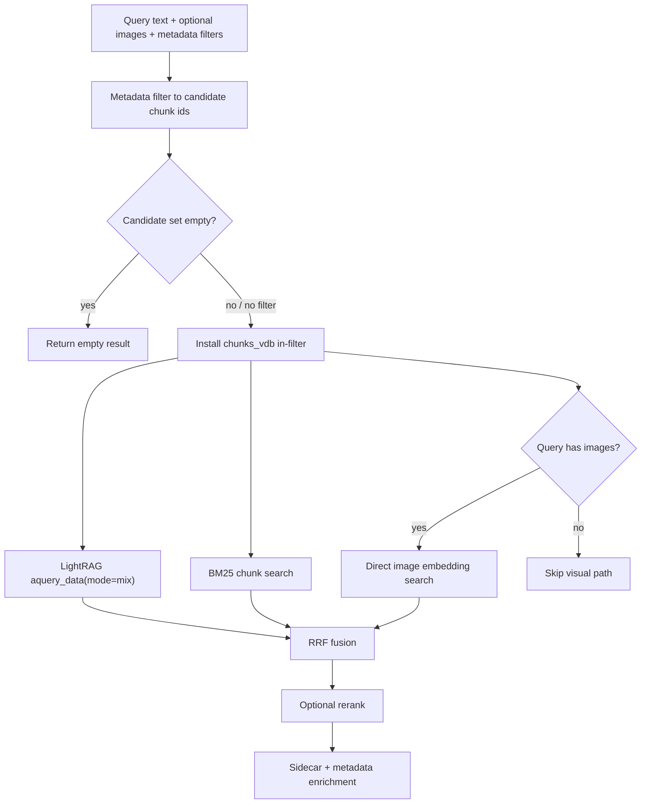

# LightRAG Main Sidecar Unified Architecture

**Date:** 2026-05-24  
**Status:** Design spec for review before implementation planning  
**Scope:** Replace DlightRAG's two ingestion/retrieval paths with one LightRAG-main-based multimodal path, while preserving metadata, in-filtering, direct image embedding, and DlightRAG-level BM25 hybrid retrieval.

---

## 1. Decision Summary

DlightRAG should move to a single unified architecture built on the current `HKUDS/LightRAG` `main` branch, not on the latest PyPI release. The verified upstream target for this design pass is:

- `HKUDS/LightRAG` `origin/main`: `cfcba71` (`2026-05-24T00:39:17+08:00`)
- MinerU upstream checked at `1d15485` on `origin/master`; current license is `LicenseRef-MinerU-Open-Source-License`, based on Apache 2.0 with additional terms, and no longer AGPL.

The new architecture deletes the `raganything` dependency entirely. ArtRAG is used as a research input because it has already learned how to work with the latest LightRAG sidecar model, but DlightRAG must not inherit ArtRAG domain concepts, copy ArtRAG class boundaries wholesale, or keep an ArtRAG-shaped artist/artwork hierarchy.

Hard decisions:

- There is no `caption` path and no old `unified` page-render path.
- There is one ingestion engine, one retrieval engine, and one LightRAG instance per workspace.
- LightRAG query mode is always `mix`.
- DlightRAG hybrid retrieval means `LightRAG mix + BM25 + RRF`, not LightRAG's `hybrid` query mode.
- Embedding configuration must prove multimodal capability at startup; text-only embedding models are invalid for this architecture.
- Document tables and equations use LightRAG's own multimodal document handling.
- Native images and document-extracted image sidecar assets use direct multimodal image embedding.

---

## 2. Why This Changes the Architecture

The old DlightRAG split made sense when RAGAnything owned document multimodal parsing and DlightRAG's unified mode owned page-level visual embeddings. That split is now wrong for three reasons:

1. LightRAG `main` now includes parser routing, MinerU/Docling/native parsing, sidecar outputs, multimodal analysis, and sidecar-to-chunk construction.
2. MinerU is no longer blocked by AGPL concerns for our expected usage profile.
3. Maintaining both RAGAnything and DlightRAG page-render ingestion duplicates the same lifecycle: parse, artifact management, chunk provenance, metadata filtering, deletion, and retrieval fusion.

The replacement is not "use ArtRAG". The replacement is "use the LightRAG-main sidecar model, with the clean architectural lessons ArtRAG exposed."

---

## 3. Upstream Model We Depend On

LightRAG `main` currently provides the pieces DlightRAG should treat as upstream-owned:

- `apipeline_enqueue_documents()` and `apipeline_process_enqueue_documents()` for queued document processing.
- `parse_native`, `parse_mineru`, and `parse_docling` parser routes.
- Parser sidecar files such as blocks, drawings, tables, equations, and extracted assets.
- Multimodal process options where `i` targets images/drawings, `t` targets tables, `e` targets equations, `!` skips KG, and `P` selects paragraph semantic chunking.
- `analyze_multimodal()` and sidecar chunk construction for LightRAG-owned multimodal text chunks.
- `LightRAG.aquery_data()` with `mode="mix"` for structured retrieval data.

DlightRAG should depend on these surfaces through one adapter module so upstream private storage changes fail fast and locally.

---

## 4. Target Module Boundaries

New or retained modules should be arranged around DlightRAG concerns, not historical path names:

| Module | Responsibility |
|---|---|
| `core/service.py` | Owns workspace lifecycle, LightRAG creation, config validation, storage initialization, and public APIs. |
| `core/lightrag_stores.py` | The only module allowed to touch LightRAG internals such as `chunks_vdb`, `text_chunks`, `full_docs`, and `doc_status`. |
| `core/ingestion/engine.py` | Single ingestion orchestrator for documents, native images, metadata, dedup, and deletion hooks. |
| `core/ingestion/sidecar.py` | Reads and normalizes LightRAG/MinerU/Docling sidecars into DlightRAG sidecar units. |
| `core/ingestion/direct_image.py` | Creates direct image embedding chunk specs for native images and extracted drawing/image assets. |
| `storage/document_artifacts.py` | Stores document-level parse/artifact locations and parser provenance. |
| `storage/chunk_metadata.py` | Stores chunk-to-document and chunk-to-sidecar provenance. |
| `core/retrieval/retriever.py` | Single retrieval orchestrator: metadata filter, LightRAG mix, BM25, direct image query, RRF, rerank, enrichment. |
| `core/retrieval/bm25.py` | DlightRAG BM25 backend and score normalization. |
| `core/retrieval/filtered_vdb.py` | In-filter wrapper around LightRAG vector queries with strict empty-filter semantics. |
| `core/retrieval/fusion.py` | RRF and post-merge score handling. |

Modules to delete or collapse after migration:

- `captionrag/*`
- all `raganything` import/config glue
- old `rag_mode` branching in service/config/API layers
- the old page-render-as-primary-ingest path in `unifiedrepresent/*`
- the custom `visual_chunks` KV concept if its only purpose is page-render output storage

Reusable provider code from `unifiedrepresent` can be moved, but the old mode boundary should not survive.

---

## 5. Unified Ingestion Flow

All ingest calls pass through `UnifiedIngestionEngine`.


### 5.1 Source Classification

The engine classifies source files into two high-level behaviors:

- **Document-like:** PDF, Office files, spreadsheets, presentations, HTML/Markdown/text where LightRAG parsing or normal text ingest is the primary path.
- **Native image:** PNG, JPEG, WEBP, GIF, BMP, JP2, and any source whose whole semantic identity is the image itself.

LightRAG supports some image formats through parser engines, but DlightRAG should still route native images through direct image embedding. The image is the source, not a page artifact to be converted into document text first.

### 5.2 Document-Like Files

Default document process options should be:

```text
teP
```

Meaning:

- `t`: let LightRAG handle tables.
- `e`: let LightRAG handle equations.
- `P`: use paragraph semantic chunking by default.
- no `!`: KG extraction remains enabled.
- no default `i`: document-extracted images are handled by DlightRAG direct embedding, not by LightRAG image-analysis chunks.

This default can be configurable, but the default should express the product decision: tables/equations are LightRAG-owned; drawings/images are direct-embedding-owned.

The direct image collector must read parser-emitted drawing/image assets, not LightRAG image-analysis chunks. If a parser backend only emits those assets when its image extraction switch is enabled, DlightRAG may enable parser-side extraction but must still suppress LightRAG-owned image analysis as the default retrieval representation for those assets.

Document ingest steps:

1. Compute content hash and write a pending metadata skeleton.
2. Enqueue/process through LightRAG with `docs_format=FULL_DOCS_FORMAT_PENDING_PARSE`, configured parser engine (`mineru` by default where supported), and process options defaulting to `teP`.
3. Let LightRAG write its normal document chunks, KG records, and `doc_status`.
4. Read parser sidecar locations from LightRAG document status and artifact metadata.
5. Persist a DlightRAG document artifact row that records source path, parse engine, process options, sidecar directory, blocks path, drawings path, tables path, equations path, and LightRAG full document id.
6. Normalize sidecars into DlightRAG sidecar units.
7. For drawing/image sidecar units only, write direct image embedding chunk rows through the LightRAG store adapter.
8. Persist chunk metadata for both LightRAG-owned text chunks and DlightRAG-owned direct image chunks.
9. Finalize metadata and hash registration only after both LightRAG and DlightRAG sidecar writes succeed.

If upstream LightRAG later exposes stable sidecar ids on its own chunks, DlightRAG should update direct image chunks in place when possible. If that mapping is not stable, DlightRAG-owned direct image chunk ids are the canonical fallback:

```text
{workspace}:{full_doc_id}:sidecar:{sidecar_type}:{sidecar_id}
```

This keeps deletion, in-filtering, and retrieval enrichment deterministic.

### 5.3 Native Images

Native image ingest does not use LightRAG document multimodal analysis. It creates a minimal DlightRAG sidecar unit:

```json
{
  "sidecar_type": "native_image",
  "source_path": "...",
  "asset_path": "...",
  "page": null,
  "bbox": null,
  "mime_type": "image/png"
}
```

The direct image path writes:

- a multimodal image vector into LightRAG's chunk vector store;
- a text chunk containing either user-provided description, configured VLM caption, or a concise file-derived fallback;
- a `doc_status`/`full_docs` record so deletion and retrieval provenance remain uniform;
- `document_artifacts` and `chunk_metadata` rows.

The vector identity is always the image itself. Captions are retrieval support material for BM25, KG, display, and citation context; they are not a substitute for image embedding.

---

## 6. Sidecar + Metadata Model

DlightRAG keeps metadata management as a first-class feature. The sidecar layer extends metadata to chunk provenance instead of replacing document metadata.

### 6.1 Document Metadata

Existing `MetadataIndexProtocol` remains the document-level filter source. It continues to store:

- system metadata such as filename, extension, size, title, author, dates, and content hash;
- user metadata;
- parser metadata such as `parse_engine`, `process_options`, `artifact_status`, and source kind.

The old `rag_mode` metadata should be removed. If a field is needed for observability, use `ingest_strategy="lightrag_sidecar_unified"`.

### 6.2 Document Artifacts

`DocumentArtifactIndex` stores parse and sidecar provenance:

```sql
CREATE TABLE dlightrag_document_artifacts (
    workspace TEXT NOT NULL,
    full_doc_id TEXT NOT NULL,
    source_uri TEXT,
    local_source_path TEXT,
    source_kind TEXT NOT NULL,
    parse_engine TEXT,
    process_options TEXT,
    artifact_dir TEXT,
    blocks_path TEXT,
    drawings_path TEXT,
    tables_path TEXT,
    equations_path TEXT,
    created_at TIMESTAMPTZ DEFAULT NOW(),
    updated_at TIMESTAMPTZ DEFAULT NOW(),
    PRIMARY KEY (workspace, full_doc_id)
);
```

JSON fallback should store the same shape under the working directory for non-PG users.

### 6.3 Chunk Metadata

`ChunkMetadataIndex` is the bridge from document filters to retrieval filters:

```sql
CREATE TABLE dlightrag_chunk_metadata (
    workspace TEXT NOT NULL,
    chunk_id TEXT NOT NULL,
    full_doc_id TEXT NOT NULL,
    embedding_input_kind TEXT NOT NULL, -- text | image | multimodal
    sidecar_type TEXT,                  -- block | drawing | table | equation | native_image
    sidecar_id TEXT,
    asset_path TEXT,
    page_number INTEGER,
    bbox JSONB,
    metadata JSONB DEFAULT '{}',
    created_at TIMESTAMPTZ DEFAULT NOW(),
    updated_at TIMESTAMPTZ DEFAULT NOW(),
    PRIMARY KEY (workspace, chunk_id)
);
```

Rules:

- LightRAG-owned blocks/tables/equations are indexed as `embedding_input_kind="text"` unless upstream provides a true multimodal vector for that chunk.
- DlightRAG-owned native images and drawing/image sidecar assets are indexed as `embedding_input_kind="image"`.
- A chunk may carry sidecar metadata even when the visible retrieval text came from LightRAG.
- Metadata filters resolve document ids first, then chunk ids through this table.

---

## 7. Multimodal Embedding Requirement

Startup validation must reject configurations where the embedding model is not known to support both text and image inputs.

Provider examples that fit the requirement:

- LM Studio/OpenAI-compatible endpoints serving models such as `qwen3-vl-embedding-2b`
- Voyage multimodal embeddings such as `voyage-multimodal-3.5`
- Jina multimodal embedding models that support image inputs

Config should make this explicit:

```yaml
embedding:
  provider: openai_compatible
  model: qwen3-vl-embedding-2b
  capabilities:
    multimodal: true
```

Validation policy:

- `capabilities.multimodal` must be true.
- Direct image embedding startup probe should run unless disabled for tests.
- If the provider cannot accept image inputs, service initialization fails.
- Text-only fallback is not supported in this architecture because it would silently break native images and extracted drawing assets.

---

## 8. Retrieval Architecture

Retrieval has one orchestrator and three candidate-producing signals:

1. LightRAG semantic/KG retrieval using `QueryParam(mode="mix")`.
2. DlightRAG BM25 lexical retrieval over chunk text.
3. Direct visual retrieval when query images are present.



### 8.1 Strict In-Filtering

Metadata filters must never degrade to unfiltered retrieval by accident.

Semantics:

- `candidate_ids is None`: no metadata filter is active.
- `candidate_ids == set()`: a metadata filter is active and matched nothing; return empty immediately.
- non-empty `candidate_ids`: all vector and BM25 paths must filter to those ids.

This fixes the old ambiguity where an empty candidate set could behave like no filter.

### 8.2 LightRAG Path

The LightRAG path always calls `aquery_data()` with `mode="mix"`. Public DlightRAG APIs may accept retrieval settings, but they must not expose LightRAG query mode as a user-facing downgrade path.

The filtered vector wrapper applies candidate chunk ids inside `chunks_vdb.query()` so LightRAG's own mix retrieval only sees permitted chunks.

### 8.3 BM25 Path

BM25 is a DlightRAG retrieval signal, not a LightRAG query mode.

First implementation target:

- PG storage: use a BM25-capable index over LightRAG document chunks, scoped by `workspace`.
- Non-PG storage: use a local BM25 index over `text_chunks` for correctness, with explicit performance limits.

Fusion uses reciprocal rank fusion:

```text
score = sum(1 / (rrf_k + rank + 1))
```

Default `rrf_k` should be configurable, with `60` as a standard starting point.

BM25 must honor metadata filters by applying `candidate_ids` before ranking.

### 8.4 Direct Visual Path

When query images are supplied:

1. Embed each query image with the same multimodal embedding provider.
2. Query LightRAG's chunk vector store with the precomputed image vector.
3. Apply the same candidate id filter.
4. Prefer direct-image chunks but do not exclude LightRAG multimodal chunks if they share the same embedding space.
5. Feed results into the same RRF/rerank/enrichment pipeline.

When no query images are supplied, this path is skipped.

### 8.5 Result Enrichment

Every returned chunk should be enriched from:

- `chunk_metadata`: sidecar type, asset path, page number, bounding box, embedding input kind;
- document metadata: filename, user metadata, source fields;
- `document_artifacts`: sidecar directory and original parser provenance;
- LightRAG result data: entity/relation/chunk context from `aquery_data()`.

This preserves existing DlightRAG metadata UX while adding sidecar-specific citations.

---

## 9. Config Changes

Remove:

- `rag_mode`
- all `raganything` configuration
- caption-mode parser settings that only existed for RAGAnything
- old page rendering settings that only existed to create page images for unified mode

Keep or add:

```yaml
parser:
  engine: mineru
  process_options: teP

embedding:
  provider: openai_compatible
  model: qwen3-vl-embedding-2b
  capabilities:
    multimodal: true

retrieval:
  lightrag_mode: mix   # internal invariant; not a public mode selector
  bm25:
    enabled: true
    top_k: 40
    rrf_k: 60
  direct_visual:
    enabled: true
    top_k: 20

metadata:
  enabled: true
```

Dependency policy:

```toml
"lightrag-hku @ git+https://github.com/HKUDS/LightRAG.git@main"
```

The exact dependency syntax can follow the package manager in use, but it must target GitHub `main`, not a release specifier such as `>=1.5.0rc1`. `raganything` must be removed from runtime and optional dependencies.

---

## 10. Deletion and Re-Ingest Semantics

Deletion must cascade through all layers:

1. metadata index row;
2. hash index row;
3. document artifact row;
4. chunk metadata rows;
5. DlightRAG-owned direct image chunks in LightRAG stores;
6. LightRAG-owned document chunks, entities, relationships, full docs, and doc status;
7. sidecar/artifact files when DlightRAG owns the local artifact directory.

Re-ingest with `replace=True` should delete the old full document first, then insert fresh LightRAG and DlightRAG records. This avoids stale sidecar ids and stale candidate filters.

Existing stored data from the old `caption` and `unified` paths should be treated as requiring re-ingestion unless a later migration tool is explicitly requested.

---

## 11. ArtRAG Lessons Adopted

Adopted:

- A narrow LightRAG adapter is required because LightRAG storage internals are not a stable public API.
- Sidecar provenance must be explicit and queryable.
- Metadata filtering must resolve to candidate chunk ids before retrieval.
- Empty filters must return empty results, not unfiltered results.
- BM25 and semantic retrieval should be fused with RRF.
- Direct image embedding needs the same vector space as text query embedding.
- Tests should use golden sidecar fixtures rather than depending on full parser execution for every unit test.

Not adopted:

- Artist/artwork/document hierarchy.
- ArtRAG chunk mapping semantics.
- ArtRAG evaluation gateway.
- ArtRAG preference scoring.
- ArtRAG service names, class names, or domain-specific tables.

The point is to reuse architectural lessons, not to make DlightRAG a genericized ArtRAG.

---

## 12. Test Strategy

Required test groups:

1. **Dependency cleanup**
   - `raganything` is absent from dependencies and imports.
   - LightRAG dependency points to GitHub `main`.

2. **Config validation**
   - text-only embedding config fails startup.
   - multimodal embedding config passes startup.
   - LightRAG query mode cannot be changed away from `mix`.

3. **Document ingest golden fixture**
   - LightRAG parser pipeline is called with default `teP`.
   - table/equation sidecars become LightRAG-owned text chunks.
   - drawing/image sidecars become DlightRAG-owned direct image chunks.
   - `document_artifacts` and `chunk_metadata` are written.

4. **Native image ingest**
   - native image bypasses LightRAG document multimodal analysis.
   - image bytes are embedded directly.
   - uniform metadata, artifact, doc status, and chunk metadata are written.

5. **Metadata in-filtering**
   - no filter means no restriction.
   - matching filter restricts all retrieval paths to candidate ids.
   - empty filter returns empty results before LightRAG/BM25/vector calls.

6. **BM25 hybrid retrieval**
   - BM25 path ranks lexical matches.
   - BM25 applies workspace and candidate filters.
   - RRF merges BM25, LightRAG mix, and direct visual results deterministically.

7. **Deletion lifecycle**
   - delete removes LightRAG records, DlightRAG direct image chunks, artifact rows, chunk metadata rows, metadata rows, and hash rows.

8. **Compatibility guard**
   - missing LightRAG parser/storage surfaces fail with a clear startup error.

---

## 13. Implementation Order After Review

After this design is reviewed, the implementation plan should be split into small vertical slices:

1. Dependency/config cleanup and startup validation.
2. LightRAG store adapter and compatibility guard.
3. Artifact and chunk metadata storage.
4. Unified document ingest using LightRAG parser sidecars.
5. Native image and extracted-image direct embedding.
6. Strict in-filter retrieval.
7. BM25 + RRF hybrid retrieval.
8. Deletion lifecycle and old module removal.

The first implementation milestone should prove one document fixture containing text, table, equation, and extracted image sidecars plus one native image fixture. That is the smallest testable slice that exercises the new architecture instead of only renaming the old paths.
