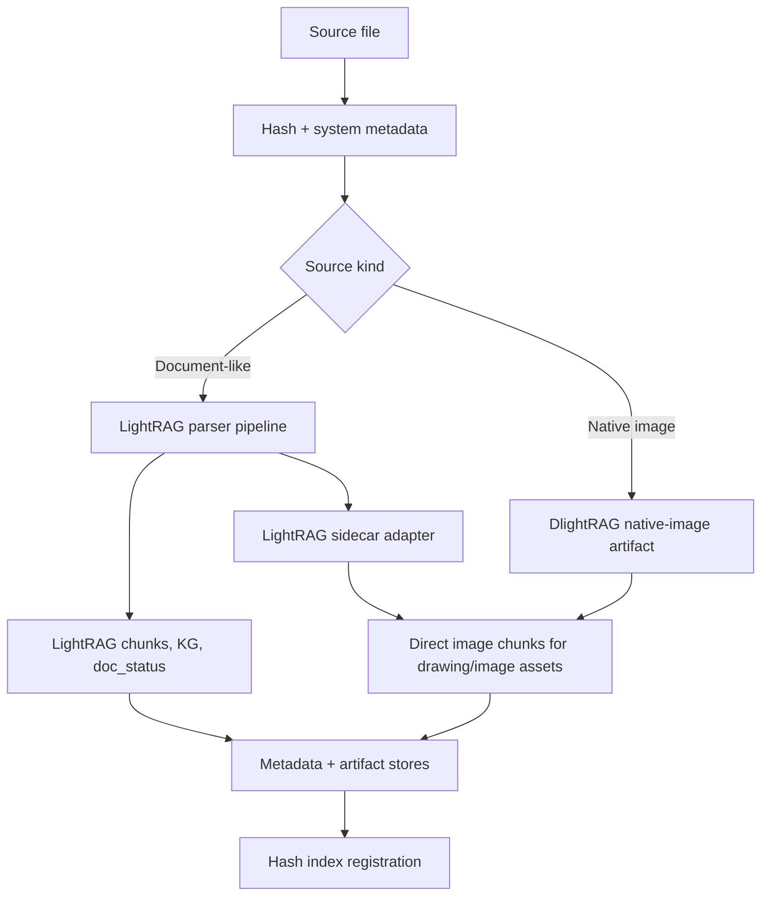
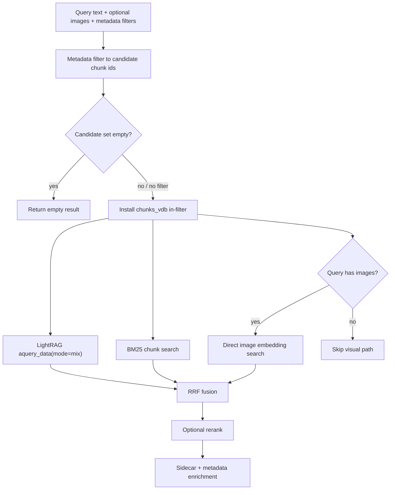

# LightRAG Main Sidecar Unified Architecture

**Date:** 2026-05-24  
**Status:** Design spec for holistic refactor planning
**Scope:** Replace DlightRAG's two ingestion/retrieval paths with one LightRAG-main-based multimodal path, while preserving PostgreSQL-backed metadata, in-filtering, direct image embedding, and DlightRAG-level BM25 hybrid retrieval.

---

## 1. Decision Summary

DlightRAG should move to a single unified architecture built on the current `HKUDS/LightRAG` `main` branch, not on the latest PyPI release. The verified upstream target for this design pass is:

- `HKUDS/LightRAG` `origin/main`: `cfcba71` (`2026-05-24T00:39:17+08:00`)
- PostgreSQL major version: `18`; current official minor checked for this design is `18.4`, released on `2026-05-14`.
- MinerU upstream checked at `1d15485` on `origin/master`; current license is `LicenseRef-MinerU-Open-Source-License`, based on Apache 2.0 with additional terms, and no longer AGPL.

The new architecture deletes the `raganything` dependency entirely. ArtRAG is used as a research input because it has already learned how to work with the latest LightRAG sidecar model, but DlightRAG must not inherit ArtRAG domain concepts, copy ArtRAG class boundaries wholesale, or keep an ArtRAG-shaped artist/artwork hierarchy.

Hard decisions:

- There is no `caption` path and no old `unified` page-render path.
- There is one ingestion engine, one retrieval engine, and one LightRAG instance per workspace.
- PostgreSQL 18 is the only supported storage ecosystem for the core product path. Development, CI, Docker, and production docs should track the current PG18 minor release; as of this design pass, that is PostgreSQL 18.4.
- LightRAG query mode is always `mix`.
- DlightRAG hybrid retrieval means `LightRAG mix + BM25 + RRF`, not LightRAG's `hybrid` query mode.
- Embedding configuration is provider-aware, multimodal, and task-aware. DlightRAG must expose LightRAG an `EmbeddingFunc` with `supports_asymmetric=True` when the provider supports query/document task routing.
- Embedding provider/model/dimension are a storage contract. Changing any dimension-affecting setting requires clearing vector data and rebuilding indexes.
- Text-only embedding models are invalid for this architecture.
- LLM configuration is role-based and aligned to LightRAG's current `role_llm_configs` surface: `extract`, `keyword`, `query`, and `vlm`.
- Document tables and equations use LightRAG's own multimodal document handling.
- Native images and document-extracted image sidecar assets use direct multimodal image embedding.
- LightRAG sidecar files are the canonical parse artifacts. DlightRAG must not write a second filesystem sidecar format; it only stores adapter-normalized references, metadata, and chunk provenance in PostgreSQL.

PostgreSQL extension requirements are layered:

| Layer | Extension | Reason |
|---|---|---|
| LightRAG vector storage | `vector` / pgvector | `PGVectorStorage` vector columns and HNSW search. |
| LightRAG graph storage | `age` / Apache AGE | `PGGraphStorage` knowledge graph storage. |
| DlightRAG BM25 hybrid | `pg_textsearch` | BM25 index/operator used by DlightRAG lexical retrieval. |

The "two plugins plus PG18" memory applies to LightRAG's core PG storage (`vector` + `age`). DlightRAG's BM25 hybrid makes `pg_textsearch` a third required extension for our target runtime. Metadata filtering remains LLM-assisted and intent-aware, but the matching layer is deterministic: exact normalized fields, date ranges, JSONB containment, and explicit filename patterns only. DlightRAG should not require or install fuzzy metadata extensions.

---

## 2. Why This Changes the Architecture

The old DlightRAG split made sense when RAGAnything owned document multimodal parsing and DlightRAG's unified mode owned page-level visual embeddings. That split is now wrong for three reasons:

1. LightRAG `main` now includes parser routing, MinerU/Docling/native parsing, sidecar outputs, multimodal analysis, and sidecar-to-chunk construction.
2. MinerU is no longer blocked by AGPL concerns for our expected usage profile.
3. Maintaining both RAGAnything and DlightRAG page-render ingestion duplicates the same lifecycle: parse, artifact management, chunk provenance, metadata filtering, deletion, and retrieval fusion.

The replacement is not "use ArtRAG". The replacement is "use the LightRAG-main sidecar model, with the clean architectural lessons ArtRAG exposed."

---

## 3. Upstream Model We Depend On

LightRAG `main` currently provides the pieces DlightRAG should treat as upstream-owned:

- `apipeline_enqueue_documents()` and `apipeline_process_enqueue_documents()` for queued document processing.
- `parse_native`, `parse_mineru`, and `parse_docling` parser routes.
- `lightrag.sidecar` writer output, `sidecar_location`, `*.blocks.jsonl`, per-modality JSON files, and extracted assets.
- Chunk-level `sidecar` references for LightRAG-built multimodal chunks.
- Multimodal process options where `i` targets images/drawings, `t` targets tables, `e` targets equations, `!` skips KG, and `P` selects paragraph semantic chunking.
- `analyze_multimodal()` and sidecar chunk construction for LightRAG-owned multimodal text chunks.
- `LightRAG.aquery_data()` with `mode="mix"` for structured retrieval data.

DlightRAG should depend on these surfaces through one adapter module so upstream private storage changes fail fast and locally. The adapter is read-only with respect to LightRAG sidecar files: it resolves and validates sidecar references, but does not translate them into another sidecar format. The supported LightRAG storage configuration is PostgreSQL 18 based: `PGVectorStorage`, `PGGraphStorage`, `PGKVStorage`, and `PGDocStatusStorage`.

---

## 4. Target Module Boundaries

New or retained modules should be arranged around DlightRAG concerns, not historical path names:

| Module | Responsibility |
|---|---|
| `core/service.py` | Owns workspace lifecycle, LightRAG creation, config validation, storage initialization, and public APIs. |
| `core/lightrag_stores.py` | The only module allowed to touch LightRAG internals such as `chunks_vdb`, `text_chunks`, `full_docs`, and `doc_status`. |
| `core/ingestion/engine.py` | Single ingestion orchestrator for documents, native images, metadata, dedup, and deletion hooks. |
| `core/ingestion/lightrag_sidecar.py` | `LightRAGSidecarAdapter`: resolves canonical LightRAG sidecar files and yields typed references for DlightRAG indexing/direct-image embedding. It does not write DlightRAG sidecar files. |
| `core/ingestion/direct_image.py` | Creates direct image embedding chunk specs for native images and extracted drawing/image assets. |
| `storage/document_artifacts.py` | `DocumentArtifactRegistry`: PostgreSQL table for document-level LightRAG sidecar URI/path references and parser provenance. |
| `storage/chunk_provenance.py` | `ChunkProvenanceIndex`: PostgreSQL table for chunk-to-document, chunk-to-sidecar, modality, asset, page, and bbox provenance. |
| `core/retrieval/retriever.py` | Single retrieval orchestrator: metadata filter, LightRAG mix, BM25, direct image query, RRF, rerank, enrichment. |
| `core/retrieval/bm25.py` | PostgreSQL BM25 search and score normalization. |
| `core/retrieval/filtered_vdb.py` | In-filter wrapper around LightRAG vector queries with strict empty-filter semantics. |
| `core/retrieval/fusion.py` | RRF and post-merge score handling. |
| `models/embedding_inputs.py` | Typed text, image, and multimodal embedding input records independent of provider payload shape. |
| `models/multimodal_embedding.py` | Shared text/image embedder used by LightRAG text embeddings and DlightRAG direct-image retrieval. |
| `models/providers/embed_providers.py` | Provider-specific task, payload, endpoint, response, image-support, and dimension rules. |
| `models/llm_roles.py` or `models/llm.py` | Canonical DlightRAG-to-LightRAG role mapping and role-specific model callables. |

Modules to delete or collapse after migration:

- `captionrag/*`
- all `raganything` import/config glue
- old `rag_mode` branching in service/config/API layers
- the old page-render-as-primary-ingest path in `unifiedrepresent/*`
- the custom `visual_chunks` KV concept if its only purpose is page-render output storage
- `storage/json_metadata_index.py` and any storage abstraction whose only product purpose is non-PostgreSQL fallback

Reusable provider code from `unifiedrepresent` can be moved, but the old mode boundary should not survive.

---

## 5. Unified Ingestion Flow

All ingest calls pass through `UnifiedIngestionEngine`.



### 5.1 Source Classification

The engine classifies source files into two high-level behaviors:

- **Document-like:** PDF, Office files, spreadsheets, presentations, HTML/Markdown/text where LightRAG parsing or normal text ingest is the primary path.
- **Native image:** PNG, JPEG, WEBP, GIF, BMP, JP2, and any source whose whole semantic identity is the image itself.

LightRAG supports some image formats through parser engines, but DlightRAG should still route native images through direct image embedding. The image is the source, not a page artifact to be converted into document text first.

### 5.2 Document-Like Files

Default document process options should be:

```text
teP
```

Meaning:

- `t`: let LightRAG handle tables.
- `e`: let LightRAG handle equations.
- `P`: use paragraph semantic chunking by default.
- no `!`: KG extraction remains enabled.
- no default `i`: document-extracted images are handled by DlightRAG direct embedding, not by LightRAG image-analysis chunks.

This default can be configurable, but the default should express the product decision: tables/equations are LightRAG-owned; drawings/images are direct-embedding-owned.

The direct image collector must read parser-emitted drawing/image assets, not LightRAG image-analysis chunks. If a parser backend only emits those assets when its image extraction switch is enabled, DlightRAG may enable parser-side extraction but must still suppress LightRAG-owned image analysis as the default retrieval representation for those assets.

Document ingest steps:

1. Compute content hash and write a pending metadata skeleton.
2. Enqueue/process through LightRAG with `docs_format=FULL_DOCS_FORMAT_PENDING_PARSE`, configured parser engine (`mineru` by default where supported), and process options defaulting to `teP`.
3. Let LightRAG write its normal document chunks, KG records, and `doc_status`.
4. Read parser sidecar locations from LightRAG document status and artifact metadata.
5. Persist a document artifact registry row that records source path, parse engine, process options, LightRAG sidecar URI/directory, blocks path, drawings path, tables path, equations path, and LightRAG full document id.
6. Use `LightRAGSidecarAdapter` to resolve LightRAG sidecar items into typed references.
7. For drawing/image sidecar references only, write direct image embedding chunk rows through the LightRAG store adapter.
8. Persist chunk provenance for both LightRAG-owned text chunks and DlightRAG-owned direct image chunks.
9. Finalize metadata and hash registration only after LightRAG writes and DlightRAG registry/provenance/direct-image writes succeed.

If upstream LightRAG later exposes stable sidecar ids on its own chunks, DlightRAG should update direct image chunks in place when possible. If that mapping is not stable, DlightRAG-owned direct image chunk ids are the canonical fallback:

```text
{workspace}:{full_doc_id}:sidecar:{sidecar_type}:{sidecar_id}
```

This keeps deletion, in-filtering, and retrieval enrichment deterministic.

### 5.3 Native Images

Native image ingest does not use LightRAG document multimodal analysis. It creates a native-image artifact/provenance record, not a DlightRAG sidecar file:

```json
{
  "source_kind": "native_image",
  "source_path": "...",
  "asset_path": "...",
  "page": null,
  "bbox": null,
  "mime_type": "image/png"
}
```

The direct image path writes:

- a multimodal image vector into LightRAG's chunk vector store;
- a text chunk containing either user-provided description, configured VLM caption, or a concise file-derived fallback;
- a `doc_status`/`full_docs` record so deletion and retrieval provenance remain uniform;
- `document_artifacts` and `chunk_provenance` rows.

The vector identity is always the image itself. Captions are retrieval support material for BM25, KG, display, and citation context; they are not a substitute for image embedding.

---

## 6. LightRAG Sidecar + Metadata Model

DlightRAG keeps metadata management as a first-class feature. LightRAG sidecars remain upstream-owned parse artifacts; DlightRAG extends them with PostgreSQL artifact references and chunk provenance instead of replacing document metadata or duplicating sidecar files.

The boundary is strict:

- LightRAG writes and owns `*.parsed/`, `*.blocks.jsonl`, modality JSON files, assets, and sidecar refs on LightRAG chunks.
- DlightRAG reads those artifacts through `LightRAGSidecarAdapter`.
- DlightRAG stores only relational references, normalized metadata, and direct-image chunk provenance.
- DlightRAG may create direct-image chunk records for native images and extracted assets, but those records point back to native source files or LightRAG sidecar items.

### 6.1 Document Metadata

Existing `PGMetadataIndex` remains the document-level filter source. It continues to store:

- system metadata such as filename, extension, size, title, author, dates, and content hash;
- user metadata;
- parser metadata such as `parse_engine`, `process_options`, `artifact_status`, and source kind.

The LLM may infer structured filters from natural language, but storage executes them deterministically. String filters use normalized case-insensitive exact matching backed by `LOWER(field)` btree expression indexes; partial file references must be represented explicitly as filename patterns.

The old `rag_mode` metadata should be removed. If a field is needed for observability, use `ingest_strategy="lightrag_sidecar_unified"`.

A protocol may remain for test doubles, but not as a product promise for non-PostgreSQL metadata backends.

### 6.2 Document Artifacts

`DocumentArtifactRegistry` stores LightRAG sidecar references and parser provenance:

```sql
CREATE TABLE dlightrag_document_artifacts (
    workspace TEXT NOT NULL,
    full_doc_id TEXT NOT NULL,
    source_uri TEXT,
    local_source_path TEXT,
    source_kind TEXT NOT NULL,
    parse_engine TEXT,
    process_options TEXT,
    artifact_dir TEXT,
    blocks_path TEXT,
    drawings_path TEXT,
    tables_path TEXT,
    equations_path TEXT,
    created_at TIMESTAMPTZ DEFAULT NOW(),
    updated_at TIMESTAMPTZ DEFAULT NOW(),
    PRIMARY KEY (workspace, full_doc_id)
);
```

There is no file-backed alternative target for this table. Development and production both use PostgreSQL 18 so metadata, chunk provenance, vector search, KG storage, and BM25 share one consistent transactional substrate.

### 6.3 Chunk Provenance

`ChunkProvenanceIndex` is the bridge from document filters to retrieval filters:

```sql
CREATE TABLE dlightrag_chunk_provenance (
    workspace TEXT NOT NULL,
    chunk_id TEXT NOT NULL,
    full_doc_id TEXT NOT NULL,
    embedding_input_kind TEXT NOT NULL, -- text | image | multimodal
    sidecar_type TEXT,                  -- block | drawing | table | equation | native_image
    sidecar_id TEXT,
    asset_path TEXT,
    page_number INTEGER,
    bbox JSONB,
    metadata JSONB DEFAULT '{}',
    created_at TIMESTAMPTZ DEFAULT NOW(),
    updated_at TIMESTAMPTZ DEFAULT NOW(),
    PRIMARY KEY (workspace, chunk_id)
);
```

Rules:

- LightRAG-owned blocks/tables/equations are indexed as `embedding_input_kind="text"` unless upstream provides a true multimodal vector for that chunk.
- DlightRAG-owned native images and drawing/image sidecar assets are indexed as `embedding_input_kind="image"`.
- A chunk may carry sidecar provenance even when the visible retrieval text came from LightRAG.
- Metadata filters resolve document ids first, then chunk ids through this table.

---

## 7. Provider-Aware Multimodal Embedding

Startup validation must reject configurations where the provider/model pair cannot embed both text and images into one shared vector space. This must be enforced by provider metadata plus a startup probe, not by a loose user-supplied boolean.

### 7.1 Normalized Inputs and Context

DlightRAG needs a provider-neutral input layer:

```python
TextEmbeddingInput(text: str)
ImageEmbeddingInput(data_uri: str | None = None, path: str | None = None, url: str | None = None)
MultimodalEmbeddingInput(parts: list[TextEmbeddingInput | ImageEmbeddingInput])
```

The public provider protocol should accept context:

```python
class EmbedProvider(Protocol):
    endpoint: str
    supports_images: bool
    supports_asymmetric: bool
    default_dim: int | None
    known_dims: frozenset[int] | None

    def build_payload(
        self,
        model: str,
        inputs: list[EmbeddingInput],
        *,
        context: Literal["query", "document"],
        output_dimension: int | None = None,
    ) -> dict: ...
```

Context mapping is mandatory:

- LightRAG document indexing calls text embedding with `context="document"`.
- DlightRAG direct-image indexing calls image embedding with `context="document"`.
- Text queries call embedding with `context="query"`.
- Image queries call image embedding with `context="query"`.
- LightRAG receives an `EmbeddingFunc(..., supports_asymmetric=True)` whenever the selected provider supports task-aware query/document routing.

This context is an embedding-generation hint, not a vector-store query flag. The stored vectors are already produced with document/index semantics; query-time retrieval first produces a query vector with query semantics, then the vector store compares vectors normally. DlightRAG APIs should therefore avoid ambiguous names such as `embed_pages()` and instead expose separate indexing/query call sites such as `embed_index_images(..., context="document")` and `embed_query_images(..., context="query")`.

### 7.2 Provider Matrix

| Provider | Target models | Context mapping | Image payload | Dimension policy |
|---|---|---|---|---|
| `voyage` | `voyage-multimodal-3.5` | `query`/`document` -> `input_type` | `/multimodalembeddings` `image_base64` content | default `1024`; validate returned dim. |
| `dashscope_qwen` | `qwen3-vl-embedding` cloud API | provider task/instruction/fusion parameters where supported | DashScope multimodal `contents` with text/image items | cloud default `2560`; allow configured dimensions such as `2048`, `1536`, `1024`, `768`, `512`, `256`. |
| `qwen_openai_compatible` | LM Studio/vLLM-style `qwen3-vl-embedding-2b` and `qwen3-vl-embedding-8b` | no asymmetric mapping by default; use provider-specific instruction or explicit task mode only when the server documents it | OpenAI-compatible `input` using text and image data URIs | validate returned dim; expected local model dims include `2048` for 2B and `4096` for 8B unless the serving stack documents projection. |
| `gemini` | `gemini-embedding-2` | map query/document to the native retrieval task behavior | native Google multimodal embedding request | default `3072`; common configured dims `1536` or `768`. |
| `jina` | Jina multimodal embeddings v4 | `query` -> `retrieval.query`, `document` -> `retrieval.passage` | Jina text/image input items | default dense `2048`; validate returned dim. |
| `openai_compatible` | explicit local or proxy provider | only asymmetric if configured/probed as task-aware | data URI passthrough if the server accepts images | no hard default; startup probe and returned-dim validation are required. |
| `ollama` | local embedding servers | text-only unless a specific server proves image support | provider-specific | not valid for this architecture unless image embedding probe passes. |

Provider detection may use model-name heuristics as a convenience, but production config should prefer an explicit `embedding.provider`. The matching layer must never infer multimodal safety only from a string containing `vl` or `multimodal`.

### 7.3 Startup Validation

Validation policy:

- `embedding.provider`, `embedding.model`, and `embedding.dim` are required for production config.
- The provider must report `supports_images=True` or pass an image embedding probe.
- Known text-only models fail startup before LightRAG initialization.
- The returned vector length must equal `embedding.dim`.
- `supports_asymmetric=True` is allowed only for providers with native task parameters or an explicit configured query/document instruction strategy. It must not be inferred from OpenAI compatibility alone.
- If `supports_asymmetric=True`, both query and document probes should be exercised where provider cost allows; unit tests can mock this.
- A provider/model/dimension change after indexing must fail fast unless the workspace is explicitly reset or vector indexes are rebuilt.

Text-only fallback is not supported because it would silently break native images and parser-extracted drawing/image assets.

---

## 8. Role-Based LLM Configuration

DlightRAG should clean up its current model configuration surface and align with LightRAG `main` role-based LLM configuration. The canonical shape is:

```yaml
llm:
  default:
    provider: openai
    model: gpt-4.1
    temperature: 0.5
  roles:
    extract:
      model: gpt-4.1-mini
    keyword:
      model: gpt-4.1-mini
    query:
      model: gpt-4.1
    vlm:
      provider: gemini
      model: gemini-2.5-flash
```

Role responsibilities:

| Role | Owner | Uses |
|---|---|---|
| `extract` | LightRAG + DlightRAG | entity extraction, document metadata normalization, structured metadata extraction. |
| `keyword` | LightRAG + DlightRAG | LightRAG keyword extraction and DlightRAG intent-aware metadata filter detection. |
| `query` | LightRAG + DlightRAG | answer generation, query planning, citation-aware responses. |
| `vlm` | LightRAG + DlightRAG | visual/multimodal analysis, parser/VLM calls, optional image descriptions. |

Cleanup rules:

- Remove product-level `ingest` as a separate LLM role; ingest-time calls map to `extract` or `vlm`.
- Rename plural `keywords` to singular `keyword` to match LightRAG.
- Pass `extract`, `keyword`, `query`, and `vlm` through LightRAG `role_llm_configs` when configured.
- Keep `embedding` and `rerank` separate from LLM roles. The `vlm` role is not a reranker.
- DlightRAG local metadata filter intent detection should use the `keyword` role, while deterministic metadata matching still happens in PostgreSQL.
- Runtime role updates can later call LightRAG `aupdate_llm_role_config()`, but the first refactor milestone only needs clean init-time configuration.

---

## 9. Retrieval Architecture

Retrieval has one orchestrator and three candidate-producing signals:

1. LightRAG semantic/KG retrieval using `QueryParam(mode="mix")`.
2. DlightRAG BM25 lexical retrieval over chunk text.
3. Direct visual retrieval when query images are present.



### 8.1 Strict In-Filtering

Metadata filters must never degrade to unfiltered retrieval by accident.

Semantics:

- `candidate_ids is None`: no metadata filter is active.
- `candidate_ids == set()`: a metadata filter is active and matched nothing; return empty immediately.
- non-empty `candidate_ids`: all vector and BM25 paths must filter to those ids.

This fixes the old ambiguity where an empty candidate set could behave like no filter.

### 8.2 LightRAG Path

The LightRAG path always calls `aquery_data()` with `mode="mix"`. Public DlightRAG APIs may accept retrieval settings, but they must not expose LightRAG query mode as a user-facing downgrade path.

The filtered vector wrapper applies candidate chunk ids inside `chunks_vdb.query()` so LightRAG's own mix retrieval only sees permitted chunks.

### 8.3 BM25 Path

BM25 is a DlightRAG retrieval signal, not a LightRAG query mode.

Implementation target:

- Use a PostgreSQL BM25-capable index over LightRAG document chunks, scoped by `workspace`.
- Prefer `pg_textsearch`/ParadeDB-style BM25 when available.
- If the BM25 extension is unavailable, fail startup when BM25 is enabled rather than silently degrading to a different backend.
- All BM25 DDL and extension checks target PostgreSQL 18.4 semantics first.

Fusion uses reciprocal rank fusion:

```text
score = sum(1 / (rrf_k + rank + 1))
```

Default `rrf_k` should be configurable, with `60` as a standard starting point.

BM25 must honor metadata filters by applying `candidate_ids` before ranking.

### 8.4 Direct Visual Path

When query images are supplied:

1. Embed each query image with the same multimodal embedding provider.
2. Query LightRAG's chunk vector store with the precomputed image vector.
3. Apply the same candidate id filter.
4. Prefer direct-image chunks but do not exclude LightRAG multimodal chunks if they share the same embedding space.
5. Feed results into the same RRF/rerank/enrichment pipeline.

When no query images are supplied, this path is skipped.

### 8.5 Result Enrichment

Every returned chunk should be enriched from:

- `chunk_provenance`: sidecar type, asset path, page number, bounding box, embedding input kind;
- document metadata: filename, user metadata, source fields;
- `document_artifacts`: sidecar directory and original parser provenance;
- LightRAG result data: entity/relation/chunk context from `aquery_data()`.

This preserves existing DlightRAG metadata UX while adding sidecar-specific citations.

---

## 10. Config Changes

Remove:

- `rag_mode`
- all `raganything` configuration
- caption-mode parser settings that only existed for RAGAnything
- old page rendering settings that only existed to create page images for unified mode
- user-selectable non-PostgreSQL LightRAG storage backends and their optional config blocks
- legacy top-level `chat`, `ingest`, `extract`, `keywords`, `query`, and `vlm` fields

Keep or add:

```yaml
storage:
  postgres_major: 18
  postgres_min_minor: "18.4"
  vector: PGVectorStorage
  graph: PGGraphStorage
  kv: PGKVStorage
  doc_status: PGDocStatusStorage

parser:
  engine: mineru
  process_options: teP

llm:
  default:
    provider: openai
    model: gpt-4.1
    temperature: 0.5
  roles:
    extract:
      model: gpt-4.1-mini
    keyword:
      model: gpt-4.1-mini
    query:
      model: gpt-4.1
    vlm:
      provider: gemini
      model: gemini-2.5-flash

embedding:
  provider: voyage
  model: voyage-multimodal-3.5
  dim: 1024
  startup_probe: true
  model_kwargs: {}

# Other valid embedding providers include dashscope_qwen,
# qwen_openai_compatible, gemini, jina, openai_compatible, and ollama
# only when image support is explicitly proven.
embedding_local_qwen_example:
  provider: qwen_openai_compatible
  model: qwen3-vl-embedding-2b
  base_url: http://host.docker.internal:1234/v1
  dim: 2048

retrieval:
  lightrag_mode: mix   # internal invariant; not a public mode selector
  bm25:
    enabled: true
    top_k: 40
    rrf_k: 60
  direct_visual:
    enabled: true
    top_k: 20

metadata:
  enabled: true
```

The storage values are operational facts, not product-mode switches. Config validation should reject PostgreSQL servers older than major version 18, and should reject `Neo4JStorage`, `MilvusVectorDBStorage`, `QdrantVectorDBStorage`, `JsonKVStorage`, `NetworkXStorage`, and other non-PostgreSQL storage choices in the core path.

Dependency policy:

```toml
"lightrag-hku @ git+https://github.com/HKUDS/LightRAG.git@main"
```

The exact dependency syntax can follow the package manager in use, but it must target GitHub `main`, not a release specifier such as `>=1.5.0rc1`. `raganything` must be removed from runtime and optional dependencies.

---

## 11. Deletion and Re-Ingest Semantics

Deletion must cascade through all layers:

1. metadata index row;
2. hash index row;
3. document artifact row;
4. chunk provenance rows;
5. DlightRAG-owned direct image chunks in LightRAG stores;
6. LightRAG-owned document chunks, entities, relationships, full docs, doc status, and parser artifact directory cleanup through the LightRAG lifecycle;
7. DlightRAG-owned native-image temp/copy artifacts, if any.

Re-ingest with `replace=True` should delete the old full document first, then insert fresh LightRAG and DlightRAG records. This avoids stale sidecar ids and stale candidate filters.

Existing stored data from the old `caption` and `unified` paths should be treated as requiring re-ingestion unless a later migration tool is explicitly requested.

---

## 12. ArtRAG Lessons Adopted

Adopted:

- A narrow LightRAG adapter is required because LightRAG storage internals are not a stable public API.
- Sidecar provenance must be explicit and queryable.
- Metadata filtering must resolve to candidate chunk ids before retrieval.
- Empty filters must return empty results, not unfiltered results.
- BM25 and semantic retrieval should be fused with RRF.
- Direct image embedding needs the same vector space as text query embedding.
- Tests should use golden sidecar fixtures rather than depending on full parser execution for every unit test.

Not adopted:

- Artist/artwork/document hierarchy.
- ArtRAG chunk mapping semantics.
- ArtRAG evaluation gateway.
- ArtRAG preference scoring.
- ArtRAG service names, class names, or domain-specific tables.

The point is to reuse architectural lessons, not to make DlightRAG a genericized ArtRAG.

---

## 13. Test Strategy

Required test groups:

1. **Dependency cleanup**
   - `raganything` is absent from dependencies and imports.
   - LightRAG dependency points to GitHub `main`.

2. **Config validation**
   - text-only embedding config fails startup.
   - multimodal embedding config passes startup.
   - provider/model/dimension mismatch fails startup.
   - LightRAG embedding wrapper declares `supports_asymmetric=True` for task-aware providers.
   - LightRAG query mode cannot be changed away from `mix`.
   - PostgreSQL server version below 18 fails startup.
   - non-PostgreSQL LightRAG storage choices fail startup.
   - `llm.roles.extract`, `llm.roles.keyword`, `llm.roles.query`, and `llm.roles.vlm` map to LightRAG `role_llm_configs`.
   - legacy `ingest` and plural `keywords` fields are rejected.

3. **Embedding provider matrix**
   - Voyage maps context to `input_type`.
   - Qwen/DashScope passes image content and configured dimension.
   - Qwen OpenAI-compatible validates returned dimensions for local models.
   - Gemini passes output dimension and retrieval task behavior.
   - Jina maps context to `retrieval.query` / `retrieval.passage`.
   - Direct image indexing uses document context; image query uses query context.

4. **Document ingest golden fixture**
   - LightRAG parser pipeline is called with default `teP`.
   - table/equation sidecars become LightRAG-owned text chunks.
   - drawing/image sidecars become DlightRAG-owned direct image chunks.
   - `document_artifacts` and `chunk_provenance` are written.

5. **Native image ingest**
   - native image bypasses LightRAG document multimodal analysis.
   - image bytes are embedded directly.
   - uniform metadata, artifact, doc status, and chunk provenance are written.

6. **Metadata in-filtering**
   - no filter means no restriction.
   - matching filter restricts all retrieval paths to candidate ids.
   - empty filter returns empty results before LightRAG/BM25/vector calls.

7. **BM25 hybrid retrieval**
   - BM25 path ranks lexical matches.
   - BM25 applies workspace and candidate filters.
   - RRF merges BM25, LightRAG mix, and direct visual results deterministically.

8. **Deletion lifecycle**
   - delete removes LightRAG records, DlightRAG direct image chunks, artifact rows, chunk provenance rows, metadata rows, and hash rows.

9. **Compatibility guard**
   - missing LightRAG parser/storage surfaces fail with a clear startup error.

---

## 14. Implementation Order After Review

After this design is reviewed, the implementation plan should be split into small vertical slices:

1. Dependency/PostgreSQL-only config cleanup and startup validation.
2. Role-based LLM config cleanup aligned to LightRAG `role_llm_configs`.
3. Provider-aware multimodal embedding contract, task context mapping, and dimension probes.
4. LightRAG store adapter and compatibility guard.
5. Artifact and chunk provenance storage.
6. Unified document ingest using LightRAG parser sidecars.
7. Native image and extracted-image direct embedding.
8. Strict in-filter retrieval.
9. BM25 + RRF hybrid retrieval.
10. Deletion lifecycle and old module removal.

The first implementation milestone should prove one document fixture containing text, table, equation, and extracted image sidecars plus one native image fixture. That is the smallest testable slice that exercises the new architecture instead of only renaming the old paths.
